# Document Information

Release 5.25

**Document number: TP_OpenL_IG_2.7_LSh**

**Revised: 03-07-2022**

*OpenL Tablets Documentation is licensed under a* [*Creative Commons Attribution 3.0 United States License*](http://creativecommons.org/licenses/by/3.0/us/)*.*

# Preface

**OpenL Tablets** is a Business Rules Management System (BRMS) based on tables presented in Microsoft Excel documents. Using unique concepts, OpenL Tablets facilitates treating business documents containing business logic specifications as an executable source code.

OpenL Tablets provides a set of tools addressing BRMS related capabilities including *OpenL Tablets WebStudio* that can be used for creating, testing, and managing business rules and business rule projects, and *OpenL Tablets Rule Services* designed for integration of business rules into customer applications.

The OpenL Tablets Installation Guide provides instructions for installing and customizing OpenL Tablets software. The document describes how to install OpenL Tablets under Apache Tomcat, deploy, and set up OpenL Tablets Rule Services.

This section includes the following topics:

-   [How This Guide Is Organized](#how-this-guide-is-organized)
-   [Audience](#audience)
-   [Related Information](#related-information)
-   [Typographic Conventions](#typographic-conventions)

## How This Guide Is Organized

| Information on how to use this guide                                                                                                                                                                |                                                                                                                  |
|-----------------------------------------------------------------------------------------------------------------------------------------------------------------------------------------------------|------------------------------------------------------------------------------------------------------------------|
| Section                                                                                                                                                                                             | Description                                                                                                      |
| [Before You Begin](#_Before_You_Begin)                                                                                                                                                              | Lists system requirements for installing and using OpenL Tablets software.                                       |
| [Install OpenL Tablets WebStudio under Apache Tomcat](#_Install_OpenL_Tablets)                                                                                                                      | Explains how to install OpenL Tablets WebStudio under Apache Tomcat.                                             |
| [Deploy OpenL Tablets Rule Services under Apache Tomcat](#deploy-openl-tablets-rule-services-under-apache-tomcat)                                                                                   | Designed for rule developers who need to use business rules as separate web services.                            |
| [Install OpenL Tablets WebStudio and OpenL Tablets Rule Services on WebSphere Application Server](#install-openl-tablets-webstudio-and-openl-tablets-rule-services-on-websphere-application-server) | Explains how to install OpenL Tablets WebStudio and OpenL Tablets Rule Services on WebSphere Application Server. |
| [Install OpenL Tablets WebStudio and OpenL Tablets Rule Services on JBoss Application Server](#install-openl-tablets-webstudio-and-openl-tablets-rule-services-on-jboss-application-server)         | Explains how to install OpenL Tablets WebStudio and OpenL Tablets Rule Services on JBoss Application Server.     |
| [OpenL Tablets WebStudio and OpenL Tablets Rule Services Integration](#openl-tablets-webstudio-and-rule-services-integration)                                                                       | Explains how to set up OpenL Tablets WebStudio and OpenL Tablets Rule Services as an integrated environment.     |
| [Troubleshooting Notes](#_Troubleshooting_Notes) [Frequently Asked Questions](#frequently-asked-questions)                                                                                          | Provides useful information related to OpenL Tablets installation.                                               |

## Audience

This guide is mainly targeted at business users and rule experts who define, view, and manage their business rules and rule projects via OpenL Tablets WebStudio. Developers can also use this document to learn how to install and set up OpenL Tablets Rule Services.

Basic knowledge of Java and Apache Tomcat is required to use this guide effectively.

## Related Information

The following table lists sources of information related to contents of this guide:

| Related information                                                                                                                                        |                                                                                                               |
|------------------------------------------------------------------------------------------------------------------------------------------------------------|---------------------------------------------------------------------------------------------------------------|
| Title                                                                                                                                                      | Description                                                                                                   |
| **[**[**OpenL Tablets WebStudio User Guide**](http://openl-tablets.org/files/openl-tablets/latest/OpenL%20Tablets%20-%20WebStudio%20User%20Guide.pdf)**]** | Describes OpenL Tablets WebStudio, a web application for managing OpenL Tablets projects through web browser. |
| **[OpenL Tablets Reference Guide]**                                                                                                                        | Provides overview of OpenL Tablets technology, as well as its basic concepts and principles.                  |
| <http://openl-tablets.org/>                                                                                                                                | OpenL Tablets open source project website.                                                                    |

## Typographic Conventions

The following styles and conventions are used in this guide:

| Typographic styles and conventions |                                                                                                                                                                                                                                                                                                                             |
|------------------------------------|-----------------------------------------------------------------------------------------------------------------------------------------------------------------------------------------------------------------------------------------------------------------------------------------------------------------------------|
| Convention                         | Description                                                                                                                                                                                                                                                                                                                 |
| **Bold**                           | Represents user interface items such as check boxes, command buttons, dialog boxes, drop-down list values, field names, menu commands, menus, option buttons, perspectives, tabs, tooltip labels, tree elements, views, and windows. Represents keys, such as F9 or CTRL+A. Represents a term the first time it is defined. |
| Courier                            | Represents file and directory names, code, system messages, and command-line commands.                                                                                                                                                                                                                                      |
| **Courier Bold**                   | Represents emphasized text in code.                                                                                                                                                                                                                                                                                         |
| **Select File \> Save As**         | Represents a command to perform, such as opening the File menu and selecting Save As.                                                                                                                                                                                                                                       |
| *Italic*                           | Represents any information to be entered in a field. Represents documentation titles.                                                                                                                                                                                                                                       |
| \< \>                              | Represents placeholder values to be substituted with user specific values.                                                                                                                                                                                                                                                  |
| Hyperlink                          | Represents a hyperlink. Clicking a hyperlink displays the information topic or external source.                                                                                                                                                                                                                             |
| **[name of guide]**                | Reference to another guide that contains additional information on a specific feature.                                                                                                                                                                                                                                      |

# Before You Begin

This section lists system requirements for OpenL Tablets software and introduces OpenL Tablets WebStudio instance properties. The following topics are included:

-   [System Requirements for OpenL Tablets Software](#system-requirements-for-openl-tablets-software)
-   [Common Information about OpenL Tablets WebStudio Instances](#common-information-about-openl-tablets-webstudio-instances)

## System Requirements for OpenL Tablets Software

The following table covers system requirements for installing and running OpenL Tablets software:

| Software requirements    |                                                                                                                                                                                                                                                                                                               |
|--------------------------|---------------------------------------------------------------------------------------------------------------------------------------------------------------------------------------------------------------------------------------------------------------------------------------------------------------|
| Software                 | Requirements description                                                                                                                                                                                                                                                                                      |
| Operating systems        | One of the following: Microsoft Windows 7+ x86/64 Ubuntu 12.x Linux 3.x **Note:** OpenL Tablets software can potentially run on any operating system that supports Java Virtual Machine, for example, Mac OS. This table lists operating systems on which the OpenL Tablets software is tested and supported. |
| Browsers                 | One of the following: Microsoft Internet Explorer 11.x Firefox 60 ESR or later Chrome 73+                                                                                                                                                                                                                     |
| Data Bases               | One of the following: MySQL 5.5+ MariaDB 10.2+ MS SQL Server 2008+ Oracle 11g + PostgreSQL 9.5+                                                                                                                                                                                                               |
| Other software           | Java v8/11/12 x86/64 Apache Tomcat 7, 8.5, 9 WebSphere Application Server 8.5 JBoss EAP 7.1                                                                                                                                                                                                                   |
| Hardware requirements    |                                                                                                                                                                                                                                                                                                               |
|                          | RAM 4 GB minimum. 6 GB is recommended. 1 GHz or faster 32-bit (x86) or 64-bit (x64) processor.                                                                                                                                                                                                                |
| User rights requirements |                                                                                                                                                                                                                                                                                                               |
|                          | Administrative permissions are required to install the software under Microsoft Windows or UNIX system.                                                                                                                                                                                                       |

**Note:** It is highly recommended to avoid using spaces and special characters in paths.

## Common Information about OpenL Tablets WebStudio Instances

This section provides general information about OpenL Tablets WebStudio home directory structure and resources shared among multiple OpenL Tablets WebStudio instances. The following topics are included:

-   [OpenL Tablets WebStudio Home Directory Configuration](#openl-tablets-webstudio-home-directory-configuration)
-   [Starting OpenL Tablets WebStudio in the Cluster Mode](#starting-openl-tablets-webstudio-in-the-cluster-mode)
-   [Sharing webstudio.properties](#sharing-webstudioproperties)
-   [Sharing Project History](#sharing-project-history)
-   [Sharing Project Index](#sharing-project-index)

### OpenL Tablets WebStudio Home Directory Configuration

When OpenL Tablets WebStudio is run for the first time, by default \${user.home}/.openl is used as the openl.home or OPENL_HOME directory where the application is deployed.

This folder contents depends on configuration. Example of its contents is as follows:

locks

repositories which is a settings folder

user-workspace that contains .locks folder and folders by users with .history folders

webstudio.properties file

cache

repositories that includes deploy-config and design folders

In case of multiple OpenL Tablets WebStudio instances, a shared file storage can be defined. The openl.home.shared folder must be defined in the application.properties file before launching OpenL Tablets WebStudio for the first time.

An example of the openl.home.shared folder contents is as follows:

locks

repositories which is a settings folder

user-workspace that contains the .locks folder and folders by users with .history folders

webstudio.properties file

An example of the openl.home folder contents is as follows:

cache

repositories that includes deploy-config and design folders and by default can be set to one folder

users-db, only for a local h2 database

This option is not available if OpenL Tablets WebStudio is installed using the installation wizard. In this case, openl.home.shared is set equal to openl.home and it cannot be modified in the installation wizard.

### Starting OpenL Tablets WebStudio in the Cluster Mode

To start OpenL Tablets WebStudio in the cluster mode, the openl.home.shared or OPENL_HOME_SHARED property must be defined properly. In the cluster mode, the same file storage can be used for multiple OpenL Tablets WebStudio instances.

Figure 1: Multiple OpenL Tablets WebStudio instances sharing the same drive

### Sharing webstudio.properties

webstudio.properties can be shared among multiple instances of OpenL Tablets WebStudio. If the openl.home.shared path is added to application.properties before starting OpenL Tablets WebStudio, and it differs from the openl.home path, a separate folder is created for storing webstudio.properties file and administrative settings can be shared among several instances of OpenL Tablets WebStudio that have one openl.home.shared path.

### Sharing Project History

Project history can be shared among multiple instances of OpenL Tablets WebStudio.

It is stored in user workspace, in the openl.home.shared folder if set up so before launching OpenL Tablets WebStudio. Thus, users can view project history from different OpenL Tablets WebStudio instances.

### Sharing Project Index

Project index can be shared among multiple instances of OpenL Tablets WebStudio to support work with the Git non-flat structure repository from different OpenL Tablets WebStudio instances. The **openl-projects.yaml** file that contains a list of projects and their paths is now stored in repositories\\settings\\design of the openl.home.shared folder, or openl.home if the shared folder is not configured.

# Install OpenL Tablets WebStudio under Apache Tomcat

This section describes how to set up the environment for working with OpenL Tablets software and deploy OpenL Tablets WebStudio under Apache Tomcat and provides information about settings required for proper functioning of the application.

Perform the following steps:

-   [Installing JDK](#installing-jdk)
-   [Installing Apache Tomcat](#installing-apache-tomcat)
-   [Deploying OpenL Tablets WebStudio](#deploying-openl-tablets-webstudio)
-   [Configuring External User Database](#configuring-external-user-database)
-   [Setting Up OpenL Tablets WebStudio with Installation Wizard](#setting-up-openl-tablets-webstudio-with-installation-wizard)
-   [Integration with External Identify Providers](#integrationwithexternalidentityproviders)
-   [Configuring Microsoft Excel Settings for Apache Tomcat](#_Configuring_Microsoft_Excel_1)
-   [OpenL Tablets WebStudio Customization](#openl-tablets-webstudio-customization)

## Installing JDK

To install JDK, perform the following steps:

1.  Download JDK.

Options are as follows:

-   Download OpenJDK 11 available at <https://openjdk.java.net/projects/jdk/11/>.
-   Download jdk-8u231 or later from <http://www.oracle.com/technetwork/java/javase/downloads/index.html> to the target directory.

    Further in the document, this catalog is referred to as \<JAVA_HOME\>.

    **Note:** It is highly recommended to avoid installing Java in the default Program Files directory because it can cause problems due to space characters in the path to the folder.

    For more information on the installation, see <http://www.oracle.com/technetwork/java/javase/index-137561.html>.

1.  Install JDK according to the instructions.

Now the environment variable JAVA_HOME must be set to the pathname of the directory where JDK is installed.

1.  For MS Windows, set the environment variable JAVA_HOME as follows:
2.  To open the **System Properties** window, press **\<Windows\> + \<Pause\>** or right click the **My Computer** icon and in the pop-up menu, select **Properties**.
3.  In the **Advanced** tab, click **Environment Variables**.
4.  In the **System variables** area, click **New**.
5.  In the **Variable** name field, enter *JAVA_HOME.*
6.  In the **Variable** value field, enter the path to the directory where JDK is installed, for example, C:\\Java\\jdk1.8.0_231.
7.  Click **OK** to complete.
8.  For Unix/Linux environments, assuming the target directory is /usr/lib/jvm/jdk1.8.0_231, to set up the environment variable JAVA_HOME for a single user, proceed as follows:
9.  Log in to the account and open .bash_profile:nano \~/.bash_profile.
10. Add the following line:

    export JAVA_HOME=/usr/lib/jvm/jdk1.8.0_231.

11. Add or correct the system PATH as follows:

    export PATH=\$PATH:\$JAVA_HOME/bin

12. To save, press **CTRL+O** and then press **CTRL+X** to exit.
13. For Unix/Linux environments, assuming the target directory is /usr/lib/jvm/jdk1.8.0_231, to set up the environment variable JAVA_HOME for all users, proceed as follows:
14. Log in as root and open the nano /etc/profile profile.
15. Add the following line:

    export JAVA_HOME=/usr/lib/jvm/jdk1.8.0_231.

16. Add or correct the system PATH as follows:

    export PATH=\$PATH:\$JAVA_HOME/bin.

## Installing Apache Tomcat

Apache Tomcat can be installed from a ZIP file or using Windows Service Installer. The following topics are included in this section:

-   [Installing Apache Tomcat on Windows](#installing-apache-tomcat-on-windows)
-   [Installing Apache Tomcat on UNIX / Linux Machine](#installing-apache-tomcat-on-unix--linux-machine)

### Installing Apache Tomcat on Windows

This section describes how to install Apache Tomcat on Windows and includes the following topics:

-   [Installing Apache Tomcat from Zip File](#installing-apache-tomcat-from-zip-file)
-   [Installing Apache Tomcat Using Windows Service Installer](#_How_to_Installing)

#### Installing Apache Tomcat from Zip File

To install Apache Tomcat 7.0.x or later, proceed as follows:

1.  Open Apache Tomcat home page at <http://tomcat.apache.org/index.html>.
2.  In the left-hand **Download** menu, click the latest available Tomcat version.
3.  Locate the **Binary Distributions** area and in the **Core** list, click on the ZIP file corresponding to the required Windows version.
4.  Save the ZIP file in a temporary directory.
5.  Extract the downloaded ZIP file into the target folder on the computer.

This folder is referred to as \<TOMCAT_HOME\> further in this document.

1.  For Tomcat web server 7.0, to configure JVM options, open the TOMCAT_HOME/conf/server.xml file and add the URIEncoding="UTF-8" attribute for all \<Connector\> elements.

For example:

\<Connector port="8080" protocol="HTTP/1.1" connectionTimeout="20000" redirectPort="8443" URIEncoding="UTF-8"/\>

#### Installing Apache Tomcat Using Windows Service Installer

This section describes how to install Apache Tomcat using Windows Service Installer.

**Note:** It is not recommended to select this type of installation if planning to edit rule tables in Excel files from OpenL Tablets WebStudio as described in **[**[**OpenL Tablets WebStudio User Guide**](http://openl-tablets.org/files/openl-tablets/latest/OpenL%20Tablets%20-%20WebStudio%20User%20Guide.pdf)**]**, the **Modifying Tables** section. This type of installation requires additional setup. To solve this issue, contact your OpenL Tablets administrator.

**Note:** For OpenL Tablets administrator: to enable editing rule tables in Excel files from OpenL Tablets WebStudio, enable the **Allow** service to interact with desktop Tomcat service option using MMC or from the command line.

Proceed as follows:

1.  Navigate to the Apache Tomcat site at <http://tomcat.apache.org/index.html> and in the left-hand **Download** menu, click the latest available Tomcat version.
2.  Locate the **Binary Distributions** area and in the **Core** list, click the [32-bit/64-bit Windows Service Installer](http://www.sai.msu.su/apache/tomcat/tomcat-7/v7.0.29/bin/apache-tomcat-7.0.29.exe) link.

Save the apache-tomcat exe file in a temporary folder.

1.  Run the exe file and follow the instructions of the installation wizard.
2.  Click **Next**.
3.  In the **License Agreement** window, click **I Agree**.
4.  In the **Choose Components** dialog, leave the default **Normal** type of installation.

Experienced Tomcat users can select another installation type in the drop-down list.

1.  In the **Configuration** dialog, proceed with default values.
2.  In the next window, review the folder where Tomcat will be installed, the **Destination Folder**.

This folder is referred to as \<TOMCAT_HOME\> further in this document.

1.  Click **Install** to start the installation.
2.  Click **Finish** to complete.

As a result, Apache Tomcat is installed and started on the user’s computer. In the **Notification Area** located next to the clock, the  icon appears. Tomcat is managed by using this icon or from the **Start** menu.

1.  To configure JVM options for Tomcat, in the **Notification** area, right click the **Apache Tomcat** icon and select **Configure;** or click **Start \> All Programs \> Apache Tomcat 7.0 \> Configure Tomcat**.

The Apache Tomcat Properties dialog appears.

1.  Click the **Java** tab and in the **Java Options** text box, add the following lines:

    \-Xms512m

    \-Xmx2000m

    \-XX: +UseConcMarkSweepGC

    \-XX:PermSize=128m

    \-XX:MaxPermSize=512m

Note that every option must be manually entered in a separate row.

1.  Click **Apply** and then click **OK**.
2.  To restart Tomcat, in **Notification Area**, right click the Tomcat icon and select **Stop service**.

The Tomcat icon changes to .

1.  Select **Start Service**.

Alternatively, Tomcat can be restarted from the **General** tab in the **Apache Tomcat Properties** window which appears after selecting **Start \> All Programs \> Apache Tomcat 7.0 \> Configure Tomcat**.

From this point, OpenL Tablets WebStudio can be run as described in [Deploying OpenL Tablets WebStudio](#deploying-openl-tablets-webstudio).

### Installing Apache Tomcat on UNIX / Linux Machine

This section describes how to install Apache Tomcat on the UNIX or Linux machine and includes the following topics:

-   [Installing Apache Tomcat from Repository](#installing-apache-tomcat-from-repository)
-   [Installing Apache Tomcat from ZIP File](#installing-apache-tomcat-from-zip-file-1)
-   [Configuring JVM Options for Tomcat on UNIX / Linux Machine](#configuring-jvm-options-for-tomcat-on-unix--linux-machine)

#### Installing Apache Tomcat from Repository

This section describes how to install Apache Tomcat from repository as a service on Ubuntu 12.x.

**Note:** All commands must be entered into a terminal window using an account with sudo privileges.

Proceed as follows:

1.  Open a terminal window and enter the following:

    sudo apt-get install tomcat7

2.  Start Tomcat with the next command:

    sudo /etc/init.d/tomcat7 start

All necessary folders must be located in /var/lib/tomcat7.

1.  To ensure that Tomcat works properly, open the browser and enter *http://localhost:8080*.

If all is correct, Apache Tomcat displays the welcome page with a message resembling the following:

**If you're seeing this, you've successfully installed Tomcat. Congratulations!**

If the 404 error appears, try to restart Tomcat as follows:

sudo /etc/init.d/tomcat7 restart

Alternatively, stop Tomcat by entering the following command in command line and then start it as described previously:

sudo /etc/init.d/tomcat7 stop

#### Installing Apache Tomcat from ZIP File

This section describes how to install Apache Tomcat on Ubuntu 12.04 and Centos 6.3. The instructions are valid for other Linux distributions with small changes.

Proceed as follows:

1.  Download the appropriate Tomcat archive file, ZIP or tar.gz archive, from its official website <http://tomcat.apache.org/download-70.cgi> to the required user folder.

In this example, Tomcat 7.0.39 is downloaded to the /home/myuser folder.

1.  Open a terminal window and change directory to the folder containing the Tomcat archive.
2.  Extract the archive by entering the following command in the terminal, modifying the Tomcat version as required:

    tar -zxvf apache-tomcat-7.0.39.tar.gz

The apache-tomcat-7.0.39 folder appears. For example:

/home/myuser/apache-tomcat-7.0.39

1.  Change directory to the tomcat/bin:

    cd apache-tomcat-7.0.39/bin

2.  Make sure all \*.sh files are executable, that is, they have r in all positions to the left of the file name, for example, -rwxr-xr-x.

For that, in terminal, enter the following:

ls –la

The following information is displayed:

Figure 2: OpenL Tablets package is added

1.  If some sh files are not executable, enter the following command:

    chmod +x ./\*.sh

2.  Run the sturtup.sh file as follows:

    sh ./startup.sh

3.  In the browser, enter the following URL:

[*http://localhost:8080*](http://localhost:8080)

If the installation is completed successfully, the Apache Tomcat welcome screen appears. The next thing to be done is to configure JVM options for Tomcat.

#### Configuring JVM Options for Tomcat on UNIX / Linux Machine

To configure JVM options for Tomcat on a UNIX / Linux machine, proceed as follows:

1.  For UNIX, create TOMCAT_HOME/start.cmd file and type the following:

export JAVA_OPTS="\$JAVA_OPTS -Xms512m -Xmx2000m -XX:+ UseConcMarkSweepGC -XX:PermSize=128m -XX:MaxPermSize=512m"

1.  Locate the TOMCAT_HOME/conf/server.xml file and add the URIEncoding="UTF-8" attribute for all \<Connector\> elements.

For example:

\<Connector port="8080" protocol="HTTP/1.1" connectionTimeout="20000" redirectPort="8443" URIEncoding="UTF-8"/\>

1.  From this point, deploy OpenL Tablets WebStudio as described in [Deploying OpenL Tablets WebStudio](#deploying-openl-tablets-webstudio).

## Deploying OpenL Tablets WebStudio

This section describes how to deploy and run OpenL Tablets WebStudio under Tomcat.

The following topics are included:

-   [Deploying OpenL Tablets WebStudio on a Windows Machine](#_Deploying_OpenL_Tablets)
-   [Deploying OpenL Tablets WebStudio on a Linux Machine and Mac](#deploying-openl-tablets-webstudio-on-a-linux-machine-and-mac)

### Deploying OpenL Tablets WebStudio on a Windows Machine

This section describes how to deploy and run OpenL Tablets WebStudio under Tomcat on a Windows machine.

Proceed as follows:

1.  Go to the <http://openl-tablets.org/downloads> page.
2.  Click the appropriate OpenL Tablets WebStudio WAR link.
3.  Save the file in a temporary folder and then copy the OpenL Tablets WebStudio WAR file.

For example, openl-tablets-webstudio-X.X.X.war to the \<TOMCAT_HOME\>\\webapps folder.

1.  Run Tomcat as follows:
-   If Tomcat is installed from the ZIP file, in TOMCAT_HOME\\bin, click the startup.bat file.
-   If Tomcat is installed using Windows Service Installer, restart Tomcat as described in [Installing Apache Tomcat Using Windows Service Installer](#installing-apache-tomcat-using-windows-service-installer).

Tomcat unpacks the WAR file into the \<TOMCAT_HOME\>\\webapps\\\<war file name\> folder. For example, for 5.9.4 version the target folder can be \<TOMCAT_HOME\>\\webapps\\openl-tablets-webstudio-5.9.4. For convenience, the folder can be renamed as needed but remember that this name is used to launch OpenL Tablets WebStudio under Tomcat.

From this point on, run OpenL Tablets WebStudio with default settings or make additional customizations by changing the user mode and configuring an external user database as described in **[**[**OpenL Tablets Rule Services Usage and Customization Guide**](http://openl-tablets.org/files/openl-tablets/latest/OpenL%20Tablets%20-%20Rule%20Services%20Usage%20and%20Customization%20Guide.pdf)**]**.

1.  To run OpenL Tablets WebStudio, in the browser, enter the following URL:

*http://localhost:8080/\<WAR file name\>*

That is, for this example, the URL is *http://localhost:8080/openl-tablets-webstudio-5.9.4*.

OpenL Tablets WebStudio is opened in the browser on the **Welcome to Installation Wizard** page. The wizard will guide through the setup process as described in [Setting Up OpenL Tablets WebStudio with Installation Wizard](#setting-up-openl-tablets-webstudio-with-installation-wizard). When setup is complete, use OpenL Tablets WebStudio to create new projects or download existing ones.

1.  After a new release of the OpenL Tablets WebStudio is installed, click **CTRL**+**F5** or clear cookies and cash manually to reload the page in the browser.

### Deploying OpenL Tablets WebStudio on a Linux Machine and Mac

To install OpenL Tablets WebStudio under Linux and Mac OS, perform the following steps:

1.  Create the \<OPENL_HOME\> folder where the application will be deployed as follows:

    sudo mkdir /\<OPENL_HOME\>

2.  Change access rights for this folder by entering the following command in the command line:

    sudo chmod 775 -R /\<OPENL_HOME\>

3.  Change the owner for this folder:

    sudo chown tomcat7:tomcat7 /\<OPENL_HOME\>

4.  Download OpenL Tablets WebStudio WAR file from <https://github.com/openl-tablets/openl-tablets/releases/> to a temporary folder.
5.  Copy the downloaded WAR file to the Tomcat webapps folder:

    cp /home/myuser/Downloads/\<openl-tablets-webstudio-xxxx.war\>/home/myuser/\<TOMCAT_HOME\>/webapps/webstudio.war

6.  To stop Tomcat, run the following command from /home/myuser/\<TOMCAT_HOME\>/bin :

    sh shutdown.sh

7.  Start Tomcat from the same folder as follows:

    sh startup.sh

8.  In the browser, enter *http://localhost:8080/webstudio*.

If deployment is completed without errors, the OpenL Tablets WebStudio Installation Wizard described in the next step is opened in the browser.

If encountering any problems, for more information, see the following log files: home/myuser/\<TOMCAT_HOME\>/logs/catalina.out and home/myuser//\<TOMCAT_HOME\>/logs/webstudio.log

## Configuring External User Database

This step is only required if a user is planning to work in multi-user application modes such as Multi-user, Active Directory, SSO: CAS or SSO: SAML. For more information, see [Setting Up OpenL Tablets WebStudio with Installation Wizard](#_Setting_Up_OpenL_1) and use an external database such as MySQL for managing users in OpenL Tablets WebStudio.

By default, OpenL Tablets WebStudio can run using an internal user database based on the HSQLDB database engine. It is a good idea to use the internal user database for demonstration purposes because it is provided by default and requires no additional setup. But in this case, all user management changes will be lost after server restart.

In a production environment, it is strongly recommended to use an external database.

**Note:** For more information on supported platforms, see <http://openl-tablets.org/>.

The following topics are included:

-   [Adding Drivers and Installing and Configuring the Database](#_Adding_Drivers_and)
-   [Configuring MySQL Database as External User Storage](#configuring-mysql-database-as-external-user-storage)
-   [Configuring MariaDB Database as External User Storage](#configuring-mariadb-database-as-external-user-storage)
-   [Configuring Oracle Database as External User Storage](#configuring-oracle-database-as-external-user-storage)

### Adding Drivers and Installing and Configuring the Database

Before configuration, perform the following steps:

1.  Add the appropriate driver library for a database in OpenL Tablets WebStudio to \\WEB-INF\\lib\\.

Alternatively, locate required libraries directly in \\\<TOMCAT_HOME\>\\lib with other Tomcat libraries.

| Driver name for appropriate databases |                                 |
|---------------------------------------|---------------------------------|
| Database                              | Driver                          |
| MySQL                                 | mysql-connector-java-5.1.31.jar |
| MariaDB                               | mariadb-java-client-2.0.1.jar   |
| Oracle                                | ojdbc6.jar                      |
| MS SQL                                | mssql-jdbc-7.2.2.jre8.jar       |
| PostgreSQL                            | postgresql-9.3-1100.jdbc4.jar   |

For more information on URL value according to the database type, see the **URL value according to the database type** table in [Setting Up OpenL Tablets WebStudio with Installation Wizard](#setting-up-openl-tablets-webstudio-with-installation-wizard).

1.  Install the database, defining login and password and creating a new schema or service.

Ensure all database settings are completed.

1.  Start OpenL Tablets WebStudio and in the third step, select a **Multi-user**, **Active Directory** or **SSO** mode.
2.  Define database URL, username, and password.

Figure 3: Creating a connection to the Oracle database in the installation wizard

1.  Click **Finish** to close the wizard when the installation is complete.
2.  Log in with credentials of a default user created in the third step of the installation wizard, in the **Configure initial users** section.

Note that even after configuring the database as user storage, a default user is available for login. The default user can manage user settings in OpenL Tablets WebStudio, for example, create a user or add privileges to a user. All user management activities can be performed via the OpenL Tablets WebStudio UI, in the **Admin** **\> User Management** section.

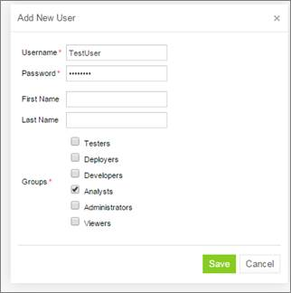

Figure 4: Managing users in the User Management section of OpenL Tablets WebStudio

Right after applying changes in OpenL Tablets WebStudio, the updates are applied to the database. A user can log in and work under a newly created account in OpenL Tablets WebStudio.

**Note:** During installation, several tables are created in the database. If the same tables exist in the database from the previous usage, a conflict occurs. To avoid this situation, the following tables must be removed:

-   ACCESSCONTROLENTRY
-   GROUP2GROUP
-   OPENLUSER
-   schema_version
-   USER2GROUP
-   USERGROUP
-   HIBERNATE_SEQUENCE table that has SEQUENCE_OWNER=OPENL

The previous steps describe configuration when a user starts OpenL Tablets WebStudio for the first time. Otherwise, in the openl\\user-workspace folder, the following changes must be made:

1.  In the system-settings folder, locate the db.properties configuration file and edit it described in the following example for the Oracle database:

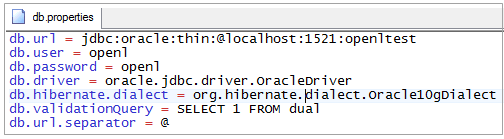

Figure 5: Configuration file with Oracle database settings

1.  In the system.properties file, set variable user.mode = multi.

### Configuring MySQL Database as External User Storage

This section explains how to set up a MySQL database. Proceed as follows:

1.  Go to <http://dev.mysql.com/downloads/mysql/>.
2.  Select the appropriate MSI Installer for system configuration and click **Download**.

For example, **Windows (x86, 32-bit)**, **MSI Installer** may be needed. It is recommended to use **ZIP Archive** version since it is intended for advanced users.

1.  In the next window, register or log in to the MySQL site.

This step can be skipped, and users can proceed to **No thanks, just start my download!** link.

1.  In the next window, select **Save File** and save the .msi file in a target folder.
2.  Navigate to the folder containing the .msi file and double click the file to start the installation process.

The **MYSQL Server Setup Wizard Welcome** window appears.

1.  Follow the wizard steps leaving the default values and clicking **Next** to proceed.
2.  Click **Finish** to close the wizard when installation is complete.

    **Note:** It is recommended to configure the database server to use the UTF-8 character set.

When MySQL is successfully installed on the user’s computer, an empty database for OpenL Tablets WebStudio in MySQL must be created and permissions to modify this database granted to the user from which the OpenL Tablets WebStudio will work with this database.

1.  To open MySQL Command Line Client, select **Start \> All Programs \> MySQL \> MySQL Server 5.5 \> MySQL Command Line Client** and enter the following commands:

CREATE USER openl_user IDENTIFIED BY 'openl_password';

CREATE DATABASE openl CHARACTER SET utf8;

GRANT ALL PRIVILEGES ON openl.\* TO openl_user;

### Configuring MariaDB Database as External User Storage

This section explains how to set up an MariaDB database. Proceed as follows:

1.  Go to <https://downloads.mariadb.org>.
2.  Select the appropriate version and click **Download**.
3.  Select the appropriate MSI Installer for system configuration and click **Download**.
4.  In the next window, select **Save File** and save the .msi file in a target folder.
5.  Navigate to the folder containing the .msi file and double click the file to start the installation process.

The **MariaDB Setup Wizard Welcome** window appears.

1.  Follow the wizard steps leaving the default values and clicking **Next** to proceed.
2.  Define password for a **root** user.
3.  Create a database.

Figure 6: Setting properties for the MariaDB database

1.  Click **Finish** to close the wizard when the installation is complete.
2.  Start HeidiSQL application.
3.  Click **New** to create a session.
4.  Select the **Prompt for credentials** check box and define a database port.

    

Figure 7: Creating a connection to the MariaDB database

1.  Click **Open** and save the changes.

### Configuring Oracle Database as External User Storage

This section explains how to set up an Oracle database. Proceed as follows:

1.  Go to <http://www.oracle.com/technetwork/database/enterprise-edition/downloads/index.html>.
2.  After registration, select the appropriate version and system configuration, and click **Download**.
3.  Unzip 2 archives in one folder and click the exe file.
4.  Configure the database and define a username and password.

These values will be used further for configuration.

1.  To improve work with database, download Oracle SQL Developer at <http://www.oracle.com/technetwork/developer-tools/sql-developer/overview/index.html>.

In this section, as an example, Oracle SQL Developer 3.2.2 is used.

1.  Start Oracle Workbench and create a connection or select an existing database connection.

Figure 8: Creating a connection to the Oracle database

1.  Enter username and password values defined when installing the database.

## Setting Up OpenL Tablets WebStudio with Installation Wizard

This topic describes the steps that must be taken after the first run of OpenL Tablets WebStudio under Tomcat or WebSphere Application Server. For more information, see [Install OpenL Tablets WebStudio and OpenL Tablets Rule Services on WebSphere Application Server](#install-openl-tablets-webstudio-and-openl-tablets-rule-services-on-websphere-application-server). Accept the default options provided by the wizard by clicking **Next** to move to the next step or change the options as required and click **Next** to proceed.

Proceed as follows:

1.  In the **Welcome to OpenL Tablets WebStudio Installation Wizard** window, click **Start**.
2.  In the next window, specify a **working directory** for OpenL Tablets.

By default, the following directory is displayed:

\${user.home}/.openl

This folder is referred to as \<OPENL_HOME\> in the documentation. It is highly recommended not to use the system drive for that.

1.  Click **Next** to proceed.
2.  Specify **deployment** and design repositories:

| Connection types for setting up design and deployment repositories |                                                                                                                                                                                                                                                                                                                                                                                                                                                                                                                                                                                                                   |
|--------------------------------------------------------------------|-------------------------------------------------------------------------------------------------------------------------------------------------------------------------------------------------------------------------------------------------------------------------------------------------------------------------------------------------------------------------------------------------------------------------------------------------------------------------------------------------------------------------------------------------------------------------------------------------------------------|
| Type                                                               | Description                                                                                                                                                                                                                                                                                                                                                                                                                                                                                                                                                                                                       |
| **Database (JDBC)**                                                | The repository is located in a database installed either local or remote. The **Repository URL** field displays URL for access to the database.                                                                                                                                                                                                                                                                                                                                                                                                                                                                   |
| **Database (JNDI)**                                                | The repository is located in a database installed either locally or remotely. The **Repository URL** field displays URL for accessing the database. Configuration settings are located in configuration files of the web server application.                                                                                                                                                                                                                                                                                                                                                                      |
| **AWS S3**                                                         | The repository is located in Amazon Simple Storage Service (AWS S3). A “bucket” is a logical unit of storage in AWS S3 and is globally unique. Choose a region for storage to reduce latency, costs etc. An **Access key** and a **Secret key** are needed to access storage. If empty, the system will retrieve it from one of the known locations as described in [AWS Documentation. Best Practices for Managing AWS Access Keys](http://docs.aws.amazon.com/general/latest/gr/aws-access-keys-best-practices.html). The **Listener period** is the interval in which to check repository changes, in seconds. |
| **Git**                                                            | The Git repository is a version control system. The Git repository can be configured as local or remote. The **URL** field displays URL for the remotely located Git repository or file path to the repository stored locally. The **Local path** identifies the folder where a Git repository local copy is stored. For more information on connection settings, see **[**[**OpenL Tablets WebStudio User Guide**](http://openl-tablets.org/files/openl-tablets/latest/OpenL%20Tablets%20-%20WebStudio%20User%20Guide.pdf)**].**                                                                                 |

If deploy configuration must be stored in a separate repository, not in Design repository, the **Use Design Repository** check box must be cleared and required parameter values must be provided.

The following table explains URL values according to the database type:

| URL value according to the database type |                                                                                        |
|------------------------------------------|----------------------------------------------------------------------------------------|
| Database                                 | URL value                                                                              |
| MySQL, MariaDB                           | jdbc:mysql://[host][:port]/[schema]                                                    |
| Oracle                                   | jdbc:oracle:thin:@//[ host][:port]/service                                             |
| MS SQL                                   | jdbc:sqlserver://[serverName[\\instanceName][:port]][;property=value[;property=value]] |
| PostgreSQL                               | jdbc:postgresql://[host][:port]/[schema]                                               |

For more details about how to configure the repository of a specific type, please refer to the corresponding subchapter below:

-   [Configuring OpenL Tablets WebStudio via JDBC Connection](#configuring-openl-tablets-webstudio-via-jdbc-connection)
-   [Configuring OpenL Tablets WebStudio via JNDI Connection](#configuring-openl-tablets-webstudio-via-jndi-connection)
-   [Configuring OpenL Tablets WebStudio via Amazon Simple Storage Service](#configuring-openl-tablets-webstudio-via-amazon-simple-storage-service)

For more information on repository security, see **[**[**OpenL Tablets WebStudio User Guide**](http://openl-tablets.org/files/openl-tablets/latest/OpenL%20Tablets%20-%20WebStudio%20User%20Guide.pdf)**],** the **Repository Settings** section.

1.  Click **Next**.
2.  Select a user mode as described in the following table:

| User modes               |                                                                                                                                                                                                                                                                                                            |
|--------------------------|------------------------------------------------------------------------------------------------------------------------------------------------------------------------------------------------------------------------------------------------------------------------------------------------------------|
| Mode                     | Description                                                                                                                                                                                                                                                                                                |
| Demo                     | This is a multi-user mode with the list of users predefined in the default database. The database does not require additional setup. All changes in the database will be lost after the application restart.                                                                                               |
| Single-user              | Only the user currently logged on to the computer can work with the OpenL Tablets WebStudio. For more information on the single user mode, see **[**[**OpenL Tablets WebStudio User Guide**](http://openl-tablets.org/files/openl-tablets/latest/OpenL%20Tablets%20-%20WebStudio%20User%20Guide.pdf)**].** |
| Multi-user (recommended) | Multiple users can run OpenL Tablets WebStudio with their unique names. WebStudio is used to authenticate and manage user credentials/permissions with External database.                                                                                                                                  |
| Active Directory         | Multiple users can run OpenL Tablets WebStudio using their unique user names. Active Directory will be used to authenticate and manage user credentials.                                                                                                                                                   |
| SSO: CAS                 | Multiple users can run OpenL Tablets WebStudio using their unique user names. CAS (Central Authentication Service) server will be used to authenticate and manage user credentials.                                                                                                                        |
| SSO: SAML                | Multiple users can run OpenL Tablets WebStudio using their unique user names. SAML (Security Assertion Markup Language) supporting Identity Provider server will be used to authenticate and manage user credentials.                                                                                      |

For **Active Directory**, **SSO: CAS**, **SSO: SAML,** user modes proceed as described in [Integration with External Identity Providers](#_Integration_with_External).

1.  If **Multi-user**, **Active Directory**, **SSO: CAS** or **SSO: SAML** mode is selected, in the **Configure database** area that appears, modify the database parameters as follows:

| Database parameters |                                                                                                                                           |
|---------------------|-------------------------------------------------------------------------------------------------------------------------------------------|
| Parameter           | Description                                                                                                                               |
| Database URL        | Enter the URL for the selected database.                                                                                                  |
| Login / Password    | Username and password specified for the database as defined in [Configuring External User Database](#configuring-external-user-database). |

1.  Click **Finish** to complete setup.

    As a result, for the **Demo, Multi-user, Active Directory**, **SSO: CAS** and **SSO: SAML** modes, the login screen appears for entering user’s credentials to start working with OpenL Tablets WebStudio. If the **openl.home** registry variable is defined, upon OpenL Tablets WebStudio update, after replacing the war file, re-running installation wizard is not required as the fact of configuration is recorded in the system registry. However, if there are multiple instances of OpenL Tablets WebStudio installed on the same computer, OpenL Tablets WebStudio must be run via system properties.

    For a list of users predefined in the **Demo** application mode, see **[**[**OpenL Tablets WebStudio User Guide**](http://openl-tablets.org/files/openl-tablets/latest/OpenL%20Tablets%20-%20WebStudio%20User%20Guide.pdf)**],** *User Management \> Manage Users.*

### Configuring OpenL Tablets WebStudio via JDBC Connection

Configure design and deployment repositories settings on the second step of OpenL Tablet WebStudio installation wizard as follows:

1.  Select **JDBC** as the type of the connection database (JDBC).
2.  Provide **URL** and authentication data.

    If the Deployment repository is created in an OpenL Tablets version older than 5.20, the **Version in deployment name** check box must be selected to enable backward compatibility.

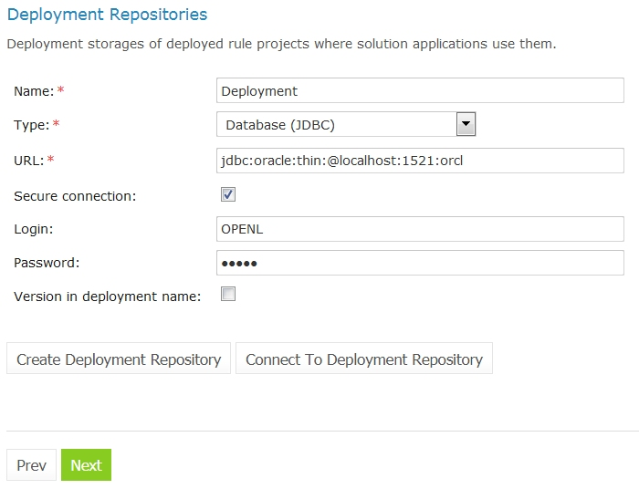

Figure 9: Setting up a JDBS connection using the installation wizard

### Configuring OpenL Tablets WebStudio via JNDI Connection

To configure the OpenL Tablets WebStudio via JNDI connection, perform the following steps:

-   [Configuring Resources for JNDI Context](#configuring-resources-for-jndi-context)
-   [Configuring Settings in OpenL Tablets WebStudio](#configuring-settings-in-openl-tablets-webstudio)

#### Configuring Resources for JNDI Context

Resource settings must be configured before deploying the application. Proceed as follows:

1.  Open the \\conf\\context.xml file in Apache Tomcat and add the Resource tag as described in the following examples.

For the Oracle database, an example is as follows:

\<Resource name=”jdbc/oracleJNDI” auth=”Container”

type=”javax.sql.DataSource” username=”user” password=”password”

driverClassName=”oracle.jdbc.OracleDriver”

url=”jdbc:oracle:thin:@localhost:1521:orcl”

maxActive=”8”

/\>

For the MySQL database, an example is as follows:

\<Resource name=”jdbc/mysqlJNDI” auth=”Container” type=”javax.sql.DataSource”

maxActive=”100” maxIdle=”30” maxWait=”10000”

username=”javauser” password=”javadude” driverClassName=”com.mysql.jdbc.Driver”

url=”jdbc:mysql://localhost:3306/javatest”

/\>

For the MS SQL database, an example is as follows:

\<Resource name=”jdbc/mssqlJNDI” auth=”Container”

type=”javax.sql.DataSource” username=”wally” password=”wally”

driverClassName=”com.microsoft.sqlserver.jdbc.SQLServerDriver”

url=”jdbc:sqlserver://localhost;DatabaseName=mytest;SelectMethod=cursor;”

maxActive=”8”

/\>

For the PostrgeSQL database, an example is as follows:

\<Resource name=”jdbc/postgres” auth=”Container”

type=”javax.sql.DataSource” username=”postgres” password=”Password1”

driverClassName=”org.postgresql.Driver”

url=”jdbc:postgresql://localhost:5432/postgres”

maxActive=”8”

/\>

1.  Save the context.xml file.

#### Configuring Settings in OpenL Tablets WebStudio

Configure design and deployment repositories settings on the second step of OpenL Tablets WebStudio installation wizard as follows:

1.  Select **JNDI** as the type of the connection database.
2.  Enter a URL in the java:comp/env/\<resource name\> format.

Definition of the authentication data, that is, login and password, is not required in the installation wizard because this information is set in context.xml file already.

1.  If the Deployment repository was created in an OpenL version older than 5.20, the checkbox “Version in deployment name” must be checked to enable backward compatibility

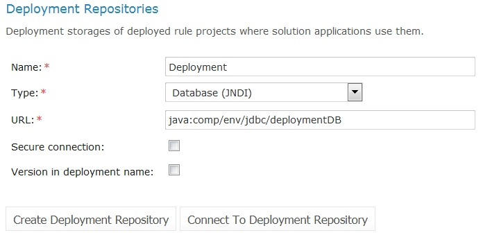

Figure 10: Setting up JNDI connection with installation wizard

### Configuring OpenL Tablets WebStudio via Amazon Simple Storage Service

Configure design and deployment repositories settings on the second step of OpenL Tablets WebStudio installation wizard as follows:

1.  Select **AWS S3** as the type of connection.
2.  Specify the following information:

| AWS S3 parameters          |                                                                                                                                                                     |
|----------------------------|---------------------------------------------------------------------------------------------------------------------------------------------------------------------|
| Parameter                  | Description                                                                                                                                                         |
| Bucket name                | Enter the name of the bucket in which your data resides.                                                                                                            |
| Region name                | Select the name of the AWS region in which your bucket resides.                                                                                                     |
| Access key                 | Enter your Amazon AWS access key.                                                                                                                                   |
| Secret key                 | Enter your Amazon AWS secret access key.                                                                                                                            |
| Listener period (sec)      | The time, in seconds, to wait for the Amazon server to respond.                                                                                                     |
| Version in deployment name | Select the **Version in deployment name** check box for backward compatibility if the deployment repository is created in an OpenL Tablets version older than 5.20. |

## Integration with External Identity Providers

To enhance sign in options for users, a third-party authentication can be established between organization authentication systems and OpenL Tablets WebStudio. After enabling third-party authentication, users can sign into OpenL Tablets using their organizational credentials.

The following topics are included in this section:

-   [Local vs. External User Management](#local-vs-external-user-management)
-   [Configuring Authentication via Active Directory](#_Configuring_Authentication_via)
-   [Configuring Single Sign On via CAS](#configuring-single-sign-on-via-cas)
-   [Configuring Single Sign On via SAML Server](#configuring-single-sign-on-via-saml-server)

### Local vs. External User Management

OpenL Tablets WebStudio allows selecting where user permissions are managed in the case of integration with external identity providers. The following options are available:

-   **local user management**

An administrator can create any groups and manage authenticated user permissions in OpenL Tablets WebStudio.

-   **external user management**

User groups are managed in Active Directory or SSO. Configure OpenL Tablets groups equal to Active Directory or SSO groups in step 4 of the installation wizard. To configure OpenL Tablets groups, proceed as described in **[**[**OpenL Tablets WebStudio User Guide**](http://openl-tablets.org/files/openl-tablets/latest/OpenL%20Tablets%20-%20WebStudio%20User%20Guide.pdf)**],** **Managing Groups** section.

For any of these options, first, initial users must be defined in the **Configure initial users** section that appears in the third step of the installation wizard. Proceed as follows:

1.  Provide at least one user to be granted administration privileges in the **Administrators** field.
2.  Select the **All authenticated users have View access** check box to grant viewer privileges by default.

    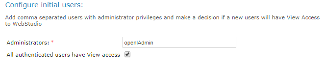

Figure 11: Configuring initial users

### Configuring Authentication via Active Directory

This section explains how to set up authentication via Active Directory. Proceed as follows:

1.  Select **Local user management** or **External user management.**

The steps required for this configuration are described in [Local vs. External User Management](#local-vs-external-user-management).

1.  Specify Active Directory domain and URL.
2.  To verify connection to Active Directory, enter credentials of the existing Active Directory user and click **Check Connection**.

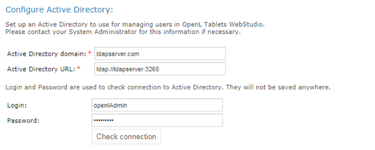

Figure 12: Configuring authentication via Active Directory

Configuration also can be defined via properties as follows:

**security.ad.domain**=**ldapserver.com**  
**security.ad.server-url**=**ldap://ldapserver:3268  
security.ad.groups-are-managed-in-studio**=**false  
security.ad.default-group**=**Viewers  
security.ad.search-filter**=**(&(objectClass=user)(userPrincipalName={0}))  
security.ad.group-filter**=**(&(objectClass=group)(member:1.2.840.113556.1.4.1941:={2}))**

### Configuring Single Sign On via CAS

This section explains how to set up authentication via CAS. Proceed as follows:

1.  Select **Local user management** or **External user management.**

The steps required for this configuration are described in [Local vs. External User Management](#local-vs-external-user-management).

1.  Define the following parameters:

| CAS configuration parameters  |                                                                                                                                          |
|-------------------------------|------------------------------------------------------------------------------------------------------------------------------------------|
| Parameter                     | Description                                                                                                                              |
| **WebStudio server URL**      | URL for OpenL Tablets WebStudio.                                                                                                         |
| **CAS server URL**            | URL for the selected CAS server.                                                                                                         |
| **Attribute for First Name**  | CAS attribute for the first name. Keep it blank if the CAS server does not return this attribute.                                        |
| **Attribute for Second Name** | CAS attribute for the second name. Keep it blank if the CAS server does not return this attribute.                                       |
| **Attribute for Groups**      | CAS attribute for groups. Keep it blank if the CAS server does not return this attribute. Applicable for **Local user management** only. |

**Note:** Contact CAS server administrator for attribute names information.

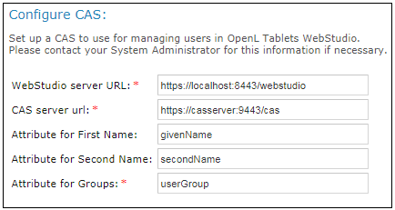

Figure 13: Configuring CAS

### Configuring Single Sign On via SAML Server

This section explains how to set up authentication via the SAML server. Proceed as follows:

1.  Select **Local user management** or **External user management.**

The steps required for this configuration are described in [Local vs. External User Management](#local-vs-external-user-management).

1.  Define the following parameters:

| SAML configuration parameters                                                |                                                                                                                                                                                                                                                                                                                                                                                                                                                     |
|------------------------------------------------------------------------------|-----------------------------------------------------------------------------------------------------------------------------------------------------------------------------------------------------------------------------------------------------------------------------------------------------------------------------------------------------------------------------------------------------------------------------------------------------|
| Parameter                                                                    | Description                                                                                                                                                                                                                                                                                                                                                                                                                                         |
| **WebStudio server URL**                                                     | URL for OpenL Tablets WebStudio.                                                                                                                                                                                                                                                                                                                                                                                                                    |
| **Entity ID**                                                                | Entity identifier. Alternatively, its value can be set for the security.saml.entity-id property, in the webstudio.properties file. An administrator must add the same entity ID to the clients list on the server which serves as an identity provider instance before setting it up in OpenL Tablets WebStudio. Adding the Entity ID parameter allows using several OpenL Tablets WebStudio instances on the same server with one Keycloak server. |
| **Metadata trust check**                                                     | Identifier that is set by default to **true** for verifying metadata signature. When metadata is not signed, the value must be set to **false** to disable verification.                                                                                                                                                                                                                                                                            |
| **Max authentication age**                                                   | Maximum time between user authentication and processing of an authentication statement. The value is in seconds.                                                                                                                                                                                                                                                                                                                                    |
| **SAML server metadata URL**                                                 | URL of the metadata XML file of the Identity Provider.                                                                                                                                                                                                                                                                                                                                                                                              |
| **Request timeout**                                                          | Time, in milliseconds, to wait for the metadata server to respond.                                                                                                                                                                                                                                                                                                                                                                                  |
| **SAML remote server X509 certificate**                                      | PEM Base-64 encoded string, which contains a public key for SAML IDP Server. The begin and end tags are not required.                                                                                                                                                                                                                                                                                                                               |
| **Authentication Contexts**                                                  | Comma separated list of authentication contexts that IDP is allowed to use when authenticating a user. This value can be left blank.                                                                                                                                                                                                                                                                                                                |
| **Local logout**                                                             | Identifier that can be set to **true** for local logout, logging out only from OpenL Tablets WebStudio, or **false** for global logout, logging out from all services using this IDP.                                                                                                                                                                                                                                                               |
| **Attribute for Username**                                                   | SAML attribute for a username. Keep it blank if SAML server does not return this attribute, or if default algorithm for username retrieval must be used.                                                                                                                                                                                                                                                                                            |
| **Attribute for First Name**                                                 | SAML attribute for the first name. Keep it blank if SAML server does not return this attribute.                                                                                                                                                                                                                                                                                                                                                     |
| **Attribute for Second Name**                                                | SAML attribute for second name. Keep it blank if SAML server does not return this attribute.                                                                                                                                                                                                                                                                                                                                                        |
| **Attribute for Groups**                                                     | SAML attribute for groups. Keep it blank if the SAML server does not return this attribute. This parameter is applicable to **external user management** only.                                                                                                                                                                                                                                                                                      |
| **Is load-balancer or reverse-proxy used in front of the local application** | Identifier that must be set to **true** if load-balancer or reverse-proxy are used in front of the OpenL Tablets WebStudio instance server.                                                                                                                                                                                                                                                                                                         |
| **Scheme of the load-balancer**                                              | Scheme of the load-balancer server. The values are **http** or **https**.                                                                                                                                                                                                                                                                                                                                                                           |
| **Server name of load balancer server**                                      | Server name of the load balancer.                                                                                                                                                                                                                                                                                                                                                                                                                   |
| **Port of the load balancer**                                                | Port of the load balancer.                                                                                                                                                                                                                                                                                                                                                                                                                          |
| **Include port to the requestURL**                                           | Identifier that, if set to **true,** denotes whether the port will be used in construction of load balancer requestURL.                                                                                                                                                                                                                                                                                                                             |
| **Context path of the load balancer**                                        | Context path of the load balancer. The value must be started with slash.                                                                                                                                                                                                                                                                                                                                                                            |

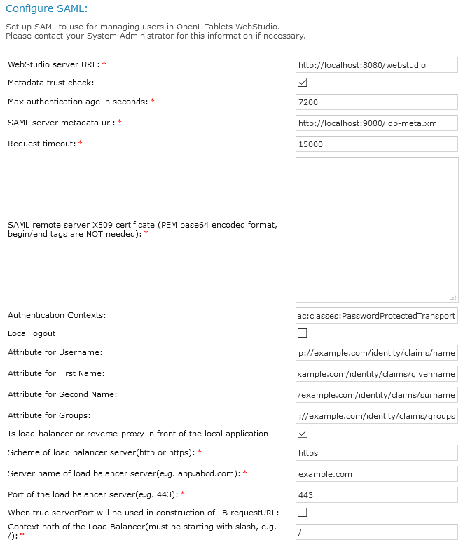

Figure 14: Configuring SAML

The following topics describe SAML configuration:

-   [Configuring SAML on Apache Tomcat with Load Balancer](#configuring-saml-on-apache-tomcat-with-load-balancer)
-   [Configuring SAML on Azure Kubernetes](#configuring-saml-on-azure-kubernetes)

#### Configuring SAML on Apache Tomcat with Load Balancer

If OpenL Tablets WebStudio instance is deployed on Tomcat and load balancer in front of the application, add the following lines to the Tomcat /conf/server.xml file:

\<Valve className="org.apache.catalina.valves.RemoteIpValve"

internalProxies=".\*"

protocolHeader="X-Forwarded-Proto"

httpsServerPort="443"

/\>

#### Configuring SAML on Azure Kubernetes

SAML configuration on Azure Kubernetes includes the following steps:

-   If the OpenL Tablets WebStudio Docker image is deployed on Azure Kubernetes, set the parameters on the Azure Basic SAML configuration as follows:

| Azure SAML configuration parameters |                                                                                                                 |
|-------------------------------------|-----------------------------------------------------------------------------------------------------------------|
| Parameter                           | Description                                                                                                     |
| Identifier (Entity ID)              | Audience of the SAML response for IDP-initiated SSO. Example: https://example.com/openl/webstudio/saml/metadata |
| Reply URL                           | Destination in the SAML response for IDP-initiated SSO. Example: <https://example.com/openl/webstudio/saml/SSO> |
| Logout URL                          | Called URL for the logout operation. Example: <https://example.com/openl/webstudio/saml/SingleLogout>           |

URLs must be accessible by Azure.

-   To specify the Azure metadata URL in the OpenL Tablets WebStudio, search for **App Federation Metadata URL** in the Azure SAML Signing certificate.

Username, first name, last name, group, and other attributes can also be retrieved from App Federation Metadata XML.

-   Build the image with the required JDBC driver.

OpenL Tablets WebStudio stores information about users and their groups in the database, so there must be a remote database server when OpenL Tablets WebStudio is used in Kubernetes.

-   Predefine groups if OpenL Tablets WebStudio catches groups from the metadata XML by group attribute property and external group management is selected.

For example, use the following command to add a group from Active Directory to the database:

insert into openl_groups(groupname, description) VALUES (\<name_of_group_in_ad\>, \<description\>);

This query adds a group to OpenL Tablets WebStudio. After that, to add authorities to this group, use one of the following approaches:

-   Use default groups from OpenL Tablets WebStudio and create a link to them as follows:

insert into openl_group2group(groupid, includedgroupid) VALUES (\<created_group_id\>, \<existing_group_in_openl_with_authorities\>);

-   Give a defined authority directly to the created group as follows:

insert into openl_group_authorities(groupid, authority) VALUES (\<created_group_id\>, \<existing_authority_id\>);

In Kubernetes, application configuration is described in the configuration map and installer must not be used. For an example of the configuration, see [Appendix B: OpenL Tablets WebStudio Image Configuration for SAML](#appendix-b-openl-tablets-webstudio-image-configuration-for-saml).

## Configuring Microsoft Excel Settings for Apache Tomcat

The **Open in Excel** functionality does not work under the default settings if Apache Tomcat is installed on Windows using Windows Service Installer as described in [Installing Apache Tomcat Using Windows Service Installer](#installing-apache-tomcat-using-windows-service-installer). This case requires a user to make several configuration changes.

To change DCOMConfig settings for Excel, proceed as follows:

1.  Run the dcomconfig.exe utility using administrator credentials:

**Start \> dcomcnfg.exe**

The **Component Services** window appears.

1.  In **Console Root**, select **Component Services \> Computers \> My Computer \> DCOM Config**.
2.  Navigate to the **Microsoft Excel Application** at the right.

If Microsoft Excel Application is not available under DCOMConfig settings, on the 64 bit system with 32 bit Office, select **Start \> Run mmc -32 \> File \> Add/Remove Snap-in… \> Component Services \> Add \> OK \> Console Root \> Component Services \> Computers \> My Computer \> DCOM Config \> Microsoft Excel Application**.

1.  Right click **Microsoft Excel Application** and in the drop-down menu, select **Properties**.
2.  In the **Microsoft Excel Application** window, click the **Identity** tab.
3.  Select **This user**.
4.  Click **OK** to complete.

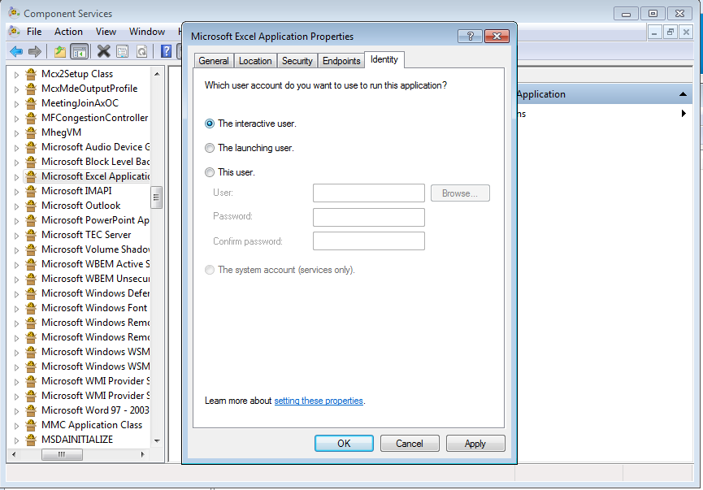

Figure 15: Microsoft Excel application properties

## OpenL Tablets WebStudio Customization

This section describes additional configuration for OpenL Tablets WebStudio and includes the following topics:

-   [Updating User Database Configuration](#updating-user-database-configuration)
-   [Configuring User Mode](#configuring-user-mode)
-   [Configuring Google Analytics](#configuring-google-analytics)
-   [Configuring Private Key for Repository Security](#configuring-private-key-for-repository-security)

### Updating User Database Configuration

User database settings, such as connection, login, and password data, are modified using the \<OPENL_HOME\>/system-settings/db.properties file.

An example of the configuration that can be used for the user database is as follows:

db.hibernate.dialect = org.hibernate.dialect.MySQLDialect

db.driver = com.mysql.jdbc.Driver

db.url = jdbc:mysql://localhost:3306/openl

db.user = openl_user

db.password = openl_password

### Configuring User Mode

Normally, user mode in OpenL Tablets WebStudio is set to **multi-user** by using OpenL Tablets WebStudio Installation Wizard as described in [Setting Up OpenL Tablets WebStudio with Installation Wizard](#_Setting_Up_OpenL_1).

User mode can also be changed as a JVM option for Tomcat. For that, open the **Apache Tomcat Properties** dialog as described in [Installing Apache Tomcat Using Windows Service Installer](#installing-apache-tomcat-using-windows-service-installer), and in the **Java Options** text box, add the following line:

\-Duser.mode=multi

**Note:** User mode set as a Java option takes precedence over the corresponding value specified in the OpenL Tablets WebStudio Installation Wizard. If both are defined, the Java option value is used.

### Configuring Google Analytics

Google Analytics is a service offered by [Google](https://en.wikipedia.org/wiki/Google) that generates detailed [statistics](https://en.wikipedia.org/wiki/Statistics) about [website](https://en.wikipedia.org/wiki/Website) traffic and traffic sources. To configure Google Analytics for OpenL, open the **Apache Tomcat Properties** dialog as described in [Installing Apache Tomcat Using Windows Service Installer](#installing-apache-tomcat-using-windows-service-installer) and in the **Java Options** text box, add the following lines:

\-Dwebstudio.analytics=number

Alternatively, configure Google Analytics for OpenL in the config.properties file located in \\WEB-INF\\conf\\ as follows:

webstudio.analytics=number

number is a number provided by Google during registration.

### Configuring Private Key for Repository Security

OpenL Tablets WebStudio allows connecting to secured repositories. In this case, passwords are stored in OpenL Tablets WebStudio workspace. To improve passwords protection, a private key can be used.

**Private key** is a special secure sentence for coding and encoding repository passwords. By default, the private key is empty. It can be set up as a JVM option for Tomcat by adding and specifying the value of the following parameter:

repository.encode.decode.key.

The private key must be specified without spaces.

**Note:** The private key must be configured prior to creating any secured connections. Otherwise, all stored passwords become invalid.

To enable private key usage for password encoding, modify the repository.encode.decode.key property in the {TOMCAT_HOME}\\webapps{APP_NAME}\\WEB-INF\\conf\\system.properties file. By default, for OpenL Tablets Rule Services, this property is empty, and for OpenL Tablets WebStudio, it contains the **This is the key for password secure** phrase.

# Deploy OpenL Tablets Rule Services under Apache Tomcat

This chapter is designed for rule developers who need to use business rules as separate web services.

For more information on how to configure OpenL Tablets Rule Services, see **[**[**OpenL Tablets Rule Services Usage and Customization Guide**](http://openl-tablets.org/files/openl-tablets/latest/OpenL%20Tablets%20-%20Rule%20Services%20Usage%20and%20Customization%20Guide.pdf)**].**

Before deploying OpenL Tablets Rule Services under Apache Tomcat, ensure the following tasks are performed:

-   The JAVA_HOME environment variable is set to the pathname of the directory where JDK is installed.
-   JVM options are set up as described in [Installing Apache Tomcat](#installing-apache-tomcat).

The folder where Tomcat is installed is referred to as \<TOMCAT_HOME\>.

This section contains the following topics:

-   [Downloading Preconfigured OpenL Tablets Rule Services](#downloading-preconfigured-openl-tablets-rule-services)
-   [Configuring OpenL Tablets Rule Services for a Local Data Source](#configuring-openl-tablets-rule-services-for-a-local-data-source)
-   [Configuring OpenL Tablets Rule Services for a Database Data Source](#_Attention!_For_proper)
-   [Configuring OpenL Tablets Rule Services via GIT Connection](#configuring-openl-tablets-rule-services-via-git-connection)

## Downloading Preconfigured OpenL Tablets Rule Services

To download the preconfigured OpenL Tablets Rule Services application in a WAR file, proceed as follows:

1.  Locate <http://openl-tablets.org/downloads>.
2.  Click the appropriate OpenL Tablets Rule Services WAR link.
3.  Save the WAR file to the \<TOMCAT_HOME\>\\webapps directory.

## Configuring OpenL Tablets Rule Services for a Local Data Source

This section describes how to configure settings for a local storage with deployed projects there. The following topics are included:

-   [Configuring OpenL Tablets Rule Services via Local File System](#configuring-openl-tablets-rule-services-via-local-file-system)
-   [Configuring OpenL Tablets Rule Services via Local ZIP Archives](#configuring-openl-tablets-rule-services-via-local-zip-archives)
-   [Configuring OpenL Tablets Rule Services via Classpath JAR](#configuring-openl-tablets-rule-services-via-classpath-jar)

### Configuring OpenL Tablets Rule Services via Local File System

Using a file system as a data source for user projects means that projects are stored in a local folder. This folder represents multi deployments containing one or multiple projects for each deployment. Each deployment must be represented as a separate folder and, at the same time, the project must also be represented as a separate folder inside the deployment folder.

To deploy OpenL Tablets Rule Services, configure a local file system as a data source as follows:

1.  Open the WEB-INF\\classes\\application.properties file.
2.  Set the following properties with the following values:

    production-repository.factory = repo-file  
    production-repository.uri = d:/datasource/

    **Note:** For proper parsing of Java properties file, the path to the folder must be defined with a slash (‘/’) as the folders delimiter. Back slash “\\” is not allowed.

3.  Save the rule project in the appropriate datasource folder.

Every rule project must be represented as a separate folder. As an example, use OpenL Tablets Tutorial available at <http://openl-tablets.org/documentation/tutorials>.

1.  To run Tomcat, in \<TOMCAT_HOME\>\\bin, click the startup.bat file.

To ensure the deployment is successful, try loading the appropriate CXF page with web services.  
An example is <http://localhost:8080/openl-tablets-ws-X.X.X>.

**Note:** The Tomcat log file contains a URL that must be used to run the OpenL Tablets Rule Services. For a file system data source, the URL must resemble http://localhost:8080/\<ws war file name\>/\<rule project url\>?wsdl, where \<rule project url\> can be taken from the Tomcat log file.

Users can also pack their rule projects in a jar file and use this file as a data source as described in **[**[**OpenL Tablets Rule Services Usage and Customization Guide**](http://openl-tablets.org/files/openl-tablets/latest/OpenL%20Tablets%20-%20Rule%20Services%20Usage%20and%20Customization%20Guide.pdf)**],** **JAR File Data Source** section.

### Configuring OpenL Tablets Rule Services via Local ZIP Archives

Using a local zip archive as a data source for user projects means that zipped projects are stored in a local folder. This folder represents rule project or deployment as a separate zip archive:

-   Each dependent rule projects must be represented as a deployment zip archive and each project must be in a separate folder inside the deployment archive.
-   Each independent rule project must be represented as a separate zip archive.

To set up local zip archives for deployment to OpenL Tablets Rule Services, proceed as follows:

1.  Open the WEB-INF\\classes\\application.properties file.
2.  Set the following properties with the following values:

    production-repository.factory = repo-zip

    production-repository.uri = d:/datasource

3.  Save the zipped rule projects in the appropriate datasource folder.

Every rule project must be represented as a separate archive. As an example, use OpenL Tablets tutorial available at <http://openl-tablets.org/documentation/tutorials>.

It is also possible to configure separate zip archives from different locations. For that, set up the production-repository.archives property and define the exact address to the zip archive. Use the comma “,” separator to configure multiple archives. An example is as follows:

production-repository.archives = d:/datasource/project1.zip, c:/folder/project2.zip

### Configuring OpenL Tablets Rule Services via Classpath JAR

If rule projects with the rules.xml project descriptor in the archive root or deployments with the deployment.xml or deployment.yaml deployment descriptor in the archive root are packed into a JAR file and placed in the classpath, these projects are deployed at the application launch. It is default configuration.

To set up a classpath JAR for deploy to OpenL Tablets Rule Services, proceed as follows:

1.  Open the WEB-INF\\classes\\application.properties file.
2.  Set the following properties with the following values:

    production-repository.factory = repo-jar

3.  Put the JAR file with the project to \\\<TOMCAT_HOME\>\\webapps\\\<rule services file name\>\\WEB-INF\\lib.

Alternatively, zip archives with deployments or rule projects can be saved to \\\<TOMCAT_HOME\>\\webapps\\\<rule services file name\>\\WEB-INF\\classes\\openl.

## Configuring OpenL Tablets Rule Services for a Database Data Source

This section describes how to configure settings to connect to a database for storing deployed projects there. Such configuration requires that the appropriate database exists and is launched. The following topics are included:

-   [Configuring OpenL Tablets Rule Services via JDBC Connection](#configuring-openl-tablets-rule-services-via-jdbc-connection)
-   Configuring OpenL Tablets Rule Services via JNDI Connection
-   [Configuring OpenL Tablets Rule Services via AWS S3 Connection](#configuring-openl-tablets-rule-services-via-aws-s3-connection)

Before configuration, add the appropriate driver library for a database in OpenL Tablets Rule Services to \\WEB-INF\\lib\\.Alternatively, locate required libraries directly in \\\<TOMCAT_HOME\>\\lib with other Tomcat libraries. Install the database, defining a login and password and creating a new schema or service.

For more information on drivers, see the **Driver name for appropriate databases** table in [Adding Drivers and Installing and Configuring the Database](#_Adding_Drivers_and).

### Configuring OpenL Tablets Rule Services via JDBC Connection

To set up JDBC connection settings for OpenL Tablets Rule Services, proceed as follows:

1.  Open the WEB-INF\\classes\\application.properties file.
2.  Set the following properties with the following values:

    production-repository.factory = repo-jdbc

    production-repository.uri = jdbc:mysql://localhost/deployment-repository

3.  Set the URL value for production-repository.uri according to the appropriate database as described in the **URL value according to the database type** table in [Setting Up OpenL Tablets WebStudio with Installation Wizard](#setting-up-openl-tablets-webstudio-with-installation-wizard).
4.  Set the login production-repository.login and password production-repository.password for connection to the database defined while installing the database.

The password must be encoded via the Base64 encoding schema when repository.encode.decode.key is also defined.

### Configuring OpenL Tablets Rule Services via JNDI Connection

This section describes how to configure JNDI connection when OpenL Tablets Rule Services is started under Apache Tomcat. Before configuration, ensure that resources are set up in the context.xml file as described in [Configuring Resources for JNDI Context](#configuring-resources-for-jndi-context).

To configure OpenL Tablets Rule Services via JNDI connection, proceed as follows:

1.  Open the WEB-INF\\classes\\application.properties file.
2.  Set the following properties with the following values:

    production-repository.factory = repo-jndi

    production-repository.uri = java:comp/env/jdbc/deploymentDB

3.  Change the URL value for production-repository.uri according to the appropriate database as described in the **URL value according to the database type** table in [Setting Up OpenL Tablets WebStudio with Installation Wizard](#setting-up-openl-tablets-webstudio-with-installation-wizard).

    **Note:** Login and password are not required for definition inside the application.properties file while configuring JNDI settings.

### Configuring OpenL Tablets Rule Services via AWS S3 Connection

This section describes how to configure an AWS S3 connection when OpenL Tablets Rule Services is started under Apache Tomcat.

To configure OpenL Tablets Rule Services via an AWS S3 connection, proceed as follows:

1.  Build a customized version of OpenL Tablets Rule Services with dependencies on \*org.openl.rules.repository.aws v5.20.54 \*:

    Create a pom.xml file with the following content for this:

    \<?xml version="1.0" encoding="UTF-8"?\>

    \<project xmlns="http://maven.apache.org/POM/4.0.0" xmlns:xsi="http://www.w3.org/2001/XMLSchema-instance" xsi:schemaLocation="http://maven.apache.org/POM/4.0.0 http://maven.apache.org/maven-v4_0_0.xsd"\>

    \<modelVersion\>4.0.0\</modelVersion\>

    \<groupId\>com.example.openl\</groupId\>

    \<artifactId\>webservice-aws\</artifactId\>

    \<packaging\>war\</packaging\>

    \<version\>1.0-beta\</version\>

    \<properties\>

    \<project.build.sourceEncoding\>UTF-8\</project.build.sourceEncoding\>

    \<org.openl.version\>\#Define OpenL Tablets version here\#\</org.openl.version\>

    \</properties\>

    \<dependencies\>

    \<dependency\>

    \<groupId\>org.openl.rules\</groupId\>

    \<artifactId\>org.openl.rules.repository.aws\</artifactId\>

    \<version\>\${org.openl.version}\</version\>

    \</dependency\>

    \<dependency\>

    \<groupId\>org.openl.rules\</groupId\>

    \<artifactId\>org.openl.rules.ruleservice.ws\</artifactId\>

    \<type\>war\</type\>

    \<version\>\${org.openl.version}\</version\>

    \</dependency\>

    \</dependencies\>

    \<dependencyManagement\>

    \<dependencies\>

    \<dependency\>

    \<groupId\>com.fasterxml.jackson.core\</groupId\>

    \<artifactId\>jackson-databind\</artifactId\>

    \<version\>2.11.4\</version\>

    \</dependency\>

    \<dependency\>

    \<groupId\>com.fasterxml.jackson.core\</groupId\>

    \<artifactId\>jackson-annotations\</artifactId\>

    \<version\>2.11.4\</version\>

    \</dependency\>

    \<dependency\>

    \<groupId\>commons-codec\</groupId\>

    \<artifactId\>commons-codec\</artifactId\>

    \<version\>1.15\</version\>

    \</dependency\>

    \</dependencies\>

    \</dependencyManagement\>

    \</project\>

    1.  Add the following properties to the application.properties file:

        production-repository.factory = repo-aws-s3

        production-repository.bucket-name = yourBucketName

        production-repository.region-name = yourS3Region

        production-repository.access-key = yourAccessKey

        production-repository.secret-key = yourSecretKey

## Configuring OpenL Tablets Rule Services via GIT Connection

To configure OpenL Tablets Rule Services via a GIT connection, build a customized version of OpenL Tablets Rule Services with dependencies on org.openl.rules: org.openl.rules.repository.git as well:

1.  Create a pom.xml file with the following contents:

    \<?xml version="1.0" encoding="UTF-8"?\>

    \<project xmlns="http://maven.apache.org/POM/4.0.0" xmlns:xsi="http://www.w3.org/2001/XMLSchema-instance" xsi:schemaLocation="http://maven.apache.org/POM/4.0.0 http://maven.apache.org/maven-v4_0_0.xsd"\>

    \<modelVersion\>4.0.0\</modelVersion\>

    \<groupId\>com.example.openl\</groupId\>

    \<artifactId\>webservice-git\</artifactId\>

    \<packaging\>war\</packaging\>

    \<version\>1.0-beta\</version\>

    \<properties\>

    \<project.build.sourceEncoding\>UTF-8\</project.build.sourceEncoding\>

    \<org.openl.version\>\#Define OpenL Tablets version here\#\</org.openl.version\>

    \</properties\>

    \<dependencies\>

    \<dependency\>

    \<groupId\>org.openl.rules\</groupId\>

    \<artifactId\>org.openl.rules.repository.git\</artifactId\>

    \<version\>\${org.openl.version}\</version\>

    \</dependency\>

    \<dependency\>

    \<groupId\>org.openl.rules\</groupId\>

    \<artifactId\>org.openl.rules.ruleservice.ws\</artifactId\>

    \<type\>war\</type\>

    \<version\>\${org.openl.version}\</version\>

    \</dependency\>

    \</dependencies\>

    \<dependencyManagement\>

    \<dependencies\>

    \<dependency\>

    \<groupId\>com.fasterxml.jackson.core\</groupId\>

    \<artifactId\>jackson-databind\</artifactId\>

    \<version\>2.11.4\</version\>

    \</dependency\>

    \<dependency\>

    \<groupId\>com.fasterxml.jackson.core\</groupId\>

    \<artifactId\>jackson-annotations\</artifactId\>

    \<version\>2.11.4\</version\>

    \</dependency\>

    \<dependency\>

    \<groupId\>commons-codec\</groupId\>

    \<artifactId\>commons-codec\</artifactId\>

    \<version\>1.15\</version\>

    \</dependency\>

    \</dependencies\>

    \</dependencyManagement\>

    \</project\>

2.  Add the following properties to the application.properties file:

    production-repository.factory = repo-git

    production-repository.uri = https://github.com/\<your-name\>/\<your-repo\>.git

    production-repository.login = your-login

    production-repository.password = your-password

# Install OpenL Tablets WebStudio and OpenL Tablets Rule Services on WebSphere Application Server

This section explains how to install OpenL Tablets WebStudio and OpenL Tablets Rule Services on WebSphere Application Server. The following topics are included:

-   [Prerequisites](#prerequisites)
-   [Setting Up JVM Options for WebSphere Application Server](#setting-up-jvm-options-for-websphere-application-server)
-   [Preparing OpenL Tablets WAR Files](#preparing-openl-tablets-war-files)
-   [Deploying OpenL Tablets Web Applications on WebSphere Application Server](#_Step_3:_Deploy)
-   [Configuring Settings for JDBC Connection](#_Configuring_Settings_for)
-   [Configuring Settings for JNDI Connection](#configuring-settings-for-jndi-connection)
-   [Configuring Microsoft Excel Settings for WebSphere Application Server](#configuring-microsoft-excel-settings-for-websphere-application-server)

## Prerequisites

Before deploying OpenL Tablets WebStudio on WebSphere Application Server, IBM WebSphere Application Server v. 8.5 or later must be installed on the user’s local machine, or users must be granted access to a WebSphere Application Server instance with logon that has appropriate permissions to configure JVM options.

For more information on how to install IBM WebSphere Application Server, see Oracle online documentation, section *Installing and Configuring WebSphere 8.5* at <http://docs.oracle.com/cd/E24902_01/doc.91/e23435/inst_config_was85_win.htm>

**IMPORTANT!** When defining the Shared Resource Directory during the installation process, the path to the directory must be specified without spaces. Otherwise, OpenL Tablets WebStudio fails.

## Setting Up JVM Options for WebSphere Application Server

To set up JVM options for WebSphere Application Server, proceed as follows:

1.  In WebSphere Application Server Console, navigate to **Servers/ServerTypes/WebSphere Application Servers**.

The server appears in the right pane.

1.  In the right pane, click the server name.

The default value is **server1**.

1.  Locate the **Server Infrastructure** area and expand the **Java and Process Management** node.
2.  Click **Process definition**.
3.  In the upper right part of the window, click the **Java Virtual Machine** link.
4.  In the **Initial heap size** text box, enter *256*.
5.  In the **Maximum heap size** text box, enter *1024*.
6.  In the **Generic JVM Arguments**, add the following line:

    \-XX:+UseParallelOldGC -XX:PermSize=128m -XX:MaxPermSize=384M -Dclient.encoding.override=UTF-8

7.  Click **OK**.
8.  In the **Message** window which appears in the top of the form, click **Save directly to the master configuration** to save changes.
9.  Restart WebSphere Application Server.

## Preparing OpenL Tablets WAR Files

This section describes how to configure OpenL Tablets WebStudio and OpenL Tablets Rule Services WAR files. Proceed as follows:

1.  Locate <http://openl-tablets.org/downloads>.
2.  Click the appropriate OpenL Tablets WAR link.
3.  Save the file in a temporary folder.
4.  Open the downloaded WAR file as a ZIP archive.
5.  In the \\WEB-INF\\lib\\ folder, remove the following JAR files:
-   jboss-transaction-api_1.2_spec-1.0.0.Final.jar
-   geronimo-jta_1.1_spec.jar
1.  Save the WAR file.

## Deploying OpenL Tablets Web Applications on WebSphere Application Server

This section describes how to deploy OpenL Tablets WebStudio and OpenL Tablets Rule Services on WebSphere Application Server and includes the following topics:

-   [Deploying OpenL Tablets WebStudio on WebSphere Application Server](#_Deploying_OpenL_WebStudio)
-   [Deploying OpenL Tablets Rule Services on WebSphere Application Server](#deploying-openl-tablets-rule-services-on-websphere-application-server)

### Deploying OpenL Tablets WebStudio on WebSphere Application Server

To deploy OpenL Tablets WebStudio on WebSphere Application Server, proceed as follows:

1.  In a browser, enter the following URL:

*https://localhost:9043/ibm/console*

This is a default port for local installation. The **WebSphere Application Server Console** window appears.

1.  Navigate to **Applications** / **Application Types** / **WebSphere enterprise applications**.
2.  In the top line tool bar, click the **Install** button.
3.  In the **Path to the new application** area, select the modified OpenL Tablets WebStudio WAR file.

The **Local file system** option is selected by default.

1.  Click **Next** till **Step 2**.
2.  In the **Step 2: Map modules to servers** page, select the check box on the left to the file name and click **Next**.
3.  In the **Step 3: Map virtual hosts for Web modules** page, select the check box on the left to the file name and click **Next**.
4.  In the **Step 4: Map context roots for Web modules** page, in the **Context Root** text field, enter */webstudio* and click **Next**.
5.  Click **Finish** to complete.
6.  When the installation process is complete, click the **Manage Applications** link.
7.  In the next window, in the list of applications, click the OpenL Tablets WebStudio WAR file link.
8.  In the next window, locate the **Detail Properties** area and click the **Class loading and update detection** link.
9.  In the next window, select the following radio buttons:
-   Classes loaded with local class loader first (parent last)
-   Single class loader for application
1.  Click **OK** to finish.
2.  In the next window, click the **Save directly to the master configuration** link.

Now the OpenL Tablets WebStudio application is installed and started. If not, start the application.

1.  Run OpenL Tablets WebStudio by entering *http://localhost:9080/webstudio/* in a browser.

The **Welcome to OpenL Tablets WebStudio Installation Wizard** window appears allowing to set up the application as needed. For more information on the application setup, see [Configuring External User Database](#configuring-external-user-database), [Setting Up OpenL Tablets WebStudio with Installation Wizard](#setting-up-openl-tablets-webstudio-with-installation-wizard) and [OpenL Tablets WebStudio Customization](#openl-tablets-webstudio-customization).

### Deploying OpenL Tablets Rule Services on WebSphere Application Server

To deploy OpenL Tablets Rule Services on WebSphere Application Server, complete steps 1-16 described in [Deploying OpenL Tablets WebStudio on WebSphere Application Server](#deploying-openl-tablets-webstudio-on-websphere-application-server).

For more information on configuring the OpenL Tablets Rule Services settings, see [Deploy OpenL Tablets Rule Services under Apache Tomcat](#deploy-openl-tablets-rule-services-under-apache-tomcat).

## Configuring Settings for JDBC Connection

To configure OpenL Tablets WebStudio or OpenL Tablets Rule Services, prepare war files as described in [Preparing OpenL Tablets WAR Files](#preparing-openl-tablets-war-files) and then do one of the following:

-   [Configuring OpenL Tablets WebStudio via JDBC Connection](#configuring-openl-tablets-webstudio-via-jdbc-connection)
-   [Configuring OpenL Tablets Rule Services via JDBC Connection](#configuring-openl-tablets-webstudio-via-jdbc-connection)

## Configuring Settings for JNDI Connection

This section describes configuring JNDI connection settings and includes the following topics:

-   [Configuring Global JNDI Context](#configuring-global-jndi-context)
-   [Configuring Local JNDI Context](#configuring-local-jndi-context)

### Configuring Global JNDI Context

To configure global JNDI settings, perform the following actions:

-   [Configuring Authentication Data](#configuring-authentication-data)
-   [Defining a JDBC Provider](#defining-a-jdbc-provider)
-   [Creating a Data Source](#creating-a-data-source)

#### Configuring Authentication Data

To configure authentication data, proceed as follows:

1.  Open the <https://localhost:9043/ibm/console> login page\*.\*
2.  Select **Security – Global \> Authentication \> Java Authentication and Authorization Service.**
3.  Click **J2C authentication data.**
4.  In the window that appears, click **New,** fill in all mandatory fields, and click **Ok** and **Save**.

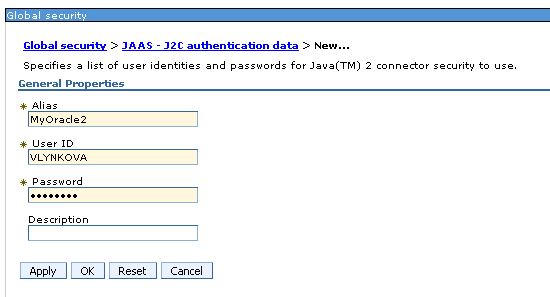

Figure 16: Setting up global security in WebSphere

#### Defining a JDBC Provider

To define a JDBC provider, proceed as follows:

1.  In the **Resources** section on the left panel, click **JDBC providers** and select the appropriate scope of the current user and server.

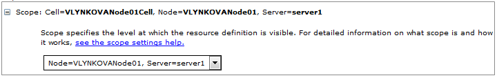

Figure 17: Configuring scope for new JDBC provider

1.  Click **New** to create a provider.
2.  Select the required **Database type**, for example, Oracle, **Provider type,** for example, Oracle JDBC Driver, **Implementation type**, for example, Connection pool data source, enter the name, and click **Next**.

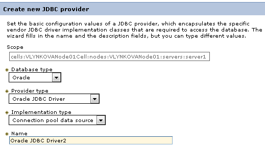

Figure 18: Creating a JDBC provider

1.  In the next page, fill in the location to appropriate driver for the Oracle database as described in the following example excluding the name of library itself:

Figure 19: Defining the location of appropriate database lib

1.  Click **Ok** and **Finish** on the last installation page.
2.  Click **Save** to complete and save provider.

#### Creating a Data Source

To create a data source, proceed as follows:

1.  In **Data source** section, select the appropriate scope of the current user and server.
2.  Click **New**.
3.  Provide basic data source information, such as data source name and JNDI name.

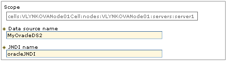

Figure 20: Configuring a data source

1.  Click **Next**.
2.  Select a JDBC provider and click **Next**.
3.  Define URL of the appropriate data user to connect to.

An example is jdbc:oracle:thin:@localhost:1521:orcl.

1.  Ensure that the **Use this data source in container managed persistence (CMP)** option is cleared and click **Next.**
2.  Define authentication settings.

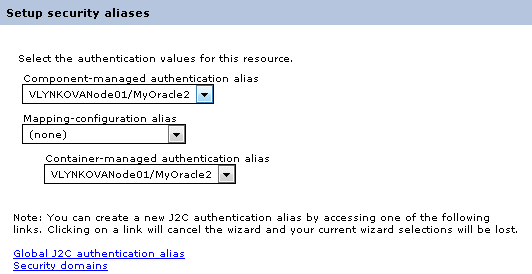

Figure 21: Configuring a data source

1.  Click **Next** and **Finish** and then save the created configuration.

When the JNDI connection is created and saved, a user can connect to the database where deployment repository will be stored. The database URL, that is, JNDI name, must have a short version of it without prefixes java:comp/env/jdbc/ because it is configured as a global JNDI context.

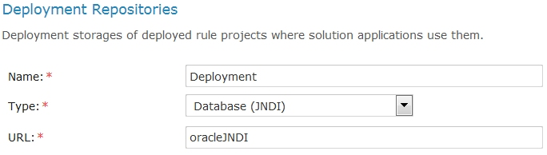

Figure 22: Connecting to the database in OpenL Tablets WebStudio via global JNDI context

To start OpenL Tablets WebStudio on WebSphere, proceed as described in [Deploying OpenL Tablets WebStudio on WebSphere Application Server](#deploying-openl-tablets-webstudio-on-websphere-application-server).

To start OpenL Tablets Rule Services on WebSphere, proceed as described in [Deploying OpenL Tablets Rule Services on WebSphere Application Server](#deploying-openl-tablets-rule-services-on-websphere-application-server).

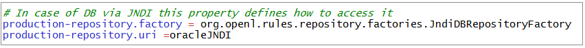

Figure 23: Configuration settings for OpenL Tablets Rule Services via global JNDI context

### Configuring Local JNDI Context

Typically, Enterprise JavaBeans (EJB) does not use the global name to look up the data source while configuring JNDI connection in an enterprise application, such as WebSphere. Instead, EJB uses a logical JNDI name that is mapped to the global JNDI name of the data source. Proceed as follows:

1.  To map a logical JNDI name to the global JNDI data source name, declare a resource reference in the deployed application \\WEB-INF\\web.xml file as follows:

    \<resource-ref\>

    \<description\>Resource reference to a factory for java.sql \</description\>

    \<res-ref-name\>jdbc/JNDIName\</res-ref-name\>

    \<res-type\>javax.sql.DataSource\</res-type\>

    \<res-auth\>Container\</res-auth\>

    \</resource-ref\>

The value of the \<res-ref-name\> tag is a logical JNDI name EJB uses to look up the data source. The value of the \<jndi-name\> tag is a global name of the data source to which the logical name is mapped.

1.  When the resource reference settings are added, save the file and repack the application.
2.  Start deploying OpenL Tablets WebStudio or OpenL Tablets Rule Services as described in [Deploying OpenL Tablets WebStudio on WebSphere Application Server](#deploying-openl-tablets-webstudio-on-websphere-application-server), steps 1-5.
3.  In the **Map resource references to resources** window, in the **Set Multiple NDI Names** list, select **Target Resource JNDI Name** and click **Next**.

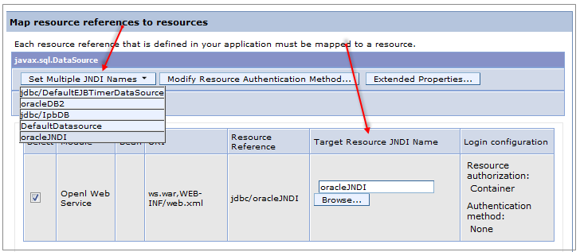

Figure 24: Configuring mapping for a local JNDI context

1.  Complete configuration as described in [Deploying OpenL Tablets WebStudio on WebSphere Application Server](#deploying-openl-tablets-webstudio-on-websphere-application-server), steps 7-16.

## Configuring Microsoft Excel Settings for WebSphere Application Server

The **Open in Excel** functionality does not work if WebSphere Application Server 8.5 is used under default settings. Execute configuration changes described in [Configuring Microsoft Excel Settings for Apache Tomcat](#_Configuring_Microsoft_Excel_1).

# Install OpenL Tablets WebStudio and OpenL Tablets Rule Services on JBoss Application Server

This section explains how to install OpenL Tablets WebStudio and OpenL Tablets Rule Services on JBoss Application Server in a standalone mode.

The following topics are included:

-   [Deploying OpenL Tablets WebStudio on JBoss Application Server](#deploying-openl-tablets-webstudio-on-jboss-application-server)
-   [Deploying OpenL Tablets Rule Services on JBoss Application Server](#deploying-openl-tablets-rule-services-on-jboss-application-server)
-   [Setting Up a JDBC Connection](#_Setting_Up_a)
-   [Setting Up a JNDI Connection](#setting-up-a-jndi-connection)

## Deploying OpenL Tablets WebStudio on JBoss Application Server

To deploy OpenL Tablets WebStudio on JBoss Application Server, proceed as follows:

1.  Rename the OpenL Tablets WebStudio war file to webstudio.war.
    1.  Copy webstudio.war to the \<JBoss home directory\>\\standalone\\deployments directory.
        1.  If the auto-deploy-zipped attribute is set to true in the standalone.xml file, manually create an empty file webstudio.war.dodeploy.
            1.  Run the \<JBoss home directory\>\\bin\\standalone.bat file.
                1.  Verify that the webstudio.war.deployed marker is generated.
                    1.  To run OpenL Tablets WebStudio, in a browser, enter *http://localhost:8080/webstudio/*.
                        1.  The **Welcome to OpenL Tablets WebStudio Installation Wizard** window.
                        2.  Set up the application as required.

## Deploying OpenL Tablets Rule Services on JBoss Application Server

To deploy OpenL Tablets Rule Services on JBoss Application Server, proceed as follows:

1.  Rename the OpenL Tablets Rule Services file to webservice.war.
2.  Copy the webservice.war file to the \<JBoss home directory\>\\standalone\\deployments directory.
3.  Run the \<JBoss home directory\>\\bin\\standalone.bat file.
4.  Verify that the webservice.war.deployed marker is generated.
5.  To run OpenL Tablets Rule Services, in a browser, enter *http://localhost:8080/webservice/*.

## Setting Up a JDBC Connection

To set up a JDBC connection for OpenL Tablets WebStudio, proceed as follows:

1.  Download a required JDBC driver.
    1.  Run \< JBoss home directory \>\\bin\\standalone.bat.
        1.  Run JBoss command line client \<JBoss home directory\>\\bin\\jboss-cli.bat.
            1.  In Jboss-cli:, connect to the server using the connect command.
                1.  In Jboss-cli:, add a module using the following command:

                    module add --name=\<module name\> --resources=\<path to the driver\> --dependencies=javax.api,javax.transaction.api

                    An example of the MySQL driver copied to the \<JBoss home directory\>\\bin directory is as follows:

                    module add --name=org.mysql --resources=mysql-connector-java-8.0.11.jar --dependencies=javax.api,javax.transaction.api

                    1.  To prepare \*.war files for deployment, in the META-INF\\jboss-deployment-structure.xml file, add the following structure:

                        \<dependencies\>

                        \<module name="\<module_name\>" export="true" /\>

                        \</dependencies\>

                        1.  For webservice.war, in the application.properties file, specify a connection to the database as follows:

production-repository.factory = org.openl.rules.repository.db.JdbcDBRepositoryFactory

production-repository.uri = jdbc:mysql://localhost/deployment-repository

1.  Ensure that the application.properties file is “visible” at the JBoss launch location.

For example, if the application.properties file is located in JBoss home directory, JBoss must be run from this directory via the bin\\standalone.bat command.

1.  Configure a JDBC connection for OpenL Tablets WebStudio as described in [Configuring OpenL Tablets WebStudio via JDBC Connection](#configuring-openl-tablets-webstudio-via-jdbc-connection).

## Setting Up a JNDI Connection

To set up a JNDI connection settings for OpenL Tablets WebStudio, proceed as follows:

1.  Copy a database driver to the \<JBoss home directory\>\\ standalone\\deployments\\ directory.
    1.  Run the \<JBoss home directory\>\\bin\\standalone.bat file.
        1.  In a browser, enter *http://localhost:8080/*.
            1.  Click **Administration console.**
                1.  Click the **Configuration** link.
                    1.  Select **Subsystems \> Datasources \> Non-XA**.
                        1.  Click **Add.**

                            

Figure 25: Configuring a JNDI connection

1.  In the **Create Datasource** window, select a data source and click **Next.**
    1.  Enter the data source name and JNDI name and click **Next.**
        1.  Switch to the **Detected Driver** tab.

            

Figure 26: JDBC Driver collection

1.  Select a JDBC driver and click **Next.**
    1.  Specify database connection settings and click **Next.**
        1.  To test the JDBC connection, click **Test Connection.**
            1.  Click **Next** and then click **Finish.**
                1.  For webservice.war, in the application.properties file, specify the connection to a database as follows:

production-repository.factory = org.openl.rules.repository.db.DatasourceDBRepositoryFactory

production-repository.uri = \<JNDI Name\>

1.  Configure a JNDI connection for OpenL Tablets WebStudio as described in [Configuring Settings in OpenL Tablets WebStudio](#configuring-settings-in-openl-tablets-webstudio).

# OpenL Tablets WebStudio and Rule Services Integration

This section describes how to set up OpenL Tablets WebStudio and OpenL Tablets Rule Services integration and enable backward compatibility and includes the following topics:

-   [Deploying Rules to the Production Server](#_Deploying_Rules_to)
-   [Integrating OpenL Tablets WebStudio and OpenL Tablets Rule Services via Database Repository](#_Backward_Compatibility_of)

## Deploying Rules to the Production Server

After integration any changes can be made in user’s rule in OpenL Tablets WebStudio, and then the project must be saved and redeployed. These changes immediately affect the rule represented as web service. During development, rules are stored in the file system of the development server. When development is finished, rules can be deployed to the production server as follows:

1.  OpenL Tablets WebStudio sends the rules project to the database repository, using the JDBC driver for connection, in case of integration via database repository.
-   
1.  The rules are saved on the production server.
2.  OpenL Tablets Rule Services detects a new version of the deployed rules and starts using it.

The following diagram illustrates the OpenL Tablets WebStudio and OpenL Tablets Rule Services integration:

Figure 27: OpenL Tablets WebStudio and OpenL Tablets Rule Services deployment

## Integrating OpenL Tablets WebStudio and OpenL Tablets Rule Services via Database Repository

This section describes an alternative way of how to set up an integrated environment that enables work with business rules from OpenL Tablets WebStudio and launch these rules as OpenL Tablets Rule Services. To set up OpenL Tablets WebStudio and OpenL Tablets Rule Services integration using the database as storage for deployment repository, proceed as follows:

1.  Install OpenL Tablets WebStudio and OpenL Tablets Rule Services on the same application server.
2.  Connect OpenL Tablets WebStudio to the database to store deployed projects as described in [Setting Up OpenL Tablets WebStudio with Installation Wizard](#setting-up-openl-tablets-webstudio-with-installation-wizard).
3.  Configure OpenL Tablets Rule Services for a database data source as described in [Configuring OpenL Tablets Rule Services for a Database Data Source](#_Configure_Web_Services_2).

# Troubleshooting Notes

If OpenL Tablets WebStudio is deployed under Tomcat in the Unix/Linux environment, consider the following troubleshooting recommendations:

1.  Before starting Tomcat under Linux, make sure that no Java processes are running:

sudo ps -A \| grep j

If found, the process name and number are displayed.

1.  If any Java process is running, stop it as follows:

kill -9 \<process number\>

1.  Make sure that port 8080 is available as follows:

sudo netstart –an \| grep 8080

1.  Run Tomcat under Linux as follows:

\<TOMCAT_HOME\>/bin/startup.sh

1.  If the **command not found** error appears, mark the .sh file as an executable script as follows:

    chmod +x startup.sh

2.  If the **Permission denied** or **The BASEDIR environment variable is not defined correctly** error is displayed, make all .sh files in the bin folder executable as follows:

chmod 777 \*.sh

1.  Verify that all .sh files in the bin folder are executable as follows:

ls –la

1.  Run Tomcat as follows:

\<TOMCAT_HOME\>/bin/startup.sh

# Frequently Asked Questions

This section provides the most common questions and answers related to the OpenL Tablets installation procedure. For more information on working with Java, Tomcat, and other third party software, see the corresponding sites of the software manufacturers.

| Frequently Asked Questions |                                                                                                                                  |                                                                                                                                                                                                                                                                                                                                          |
|----------------------------|----------------------------------------------------------------------------------------------------------------------------------|------------------------------------------------------------------------------------------------------------------------------------------------------------------------------------------------------------------------------------------------------------------------------------------------------------------------------------------|
| \#                         | Question                                                                                                                         | Answer                                                                                                                                                                                                                                                                                                                                   |
| **1**                      | How can I check if Java is installed on my PC?                                                                                   | Proceed as follows: Open **Start \> Control Panel.** Perform either of the following: For Windows XP, double click **Add or Remove Programs**. For Windows 7/Vista, click **Programs \> Programs and Features**. Look through the list for **Java(TM)…** or **Java(TM) Update…** items. If any is present, Java is installed on your PC. |
| **2**                      | During Java installation, the page for Java registration appears. Do I have to register Java?                                    | No, it is optional. You can close the registration page.                                                                                                                                                                                                                                                                                 |
| 3                          | How can I check which version of Java is installed on my PC?                                                                     | Open the [**Verify Java Version**](http://java.com/en/download/installed.jsp) page and click the **Verify Java Version** button. In a few seconds a new page appears where you will find the message like the following one: **Your Java version: Version 6 Update 26**.                                                                 |
| 4                          | How can I see the error message in the Tomcat console that appears when I start Tomcat? The error screen disappears too quickly. | Proceed as follows: Click **Start \> Run**. Locate the \<TOMCAT_HOME\>\\bin folder. Select catalina.bat and enter *run* in the command line.                                                                                                                                                                                             |

# Appendix A: Official Docker Images for OpenL Tablets

OpenL Tablets supports Docker containers. The following table provides links to the Docker images for OpenL Tablets:

| **Docker images for OpenL Tablets** |                                                    |
|-------------------------------------|----------------------------------------------------|
| **OpenL Tablet resource**           | **Reference**                                      |
| OpenL Tablets Rule Services         | <https://hub.docker.com/r/openltablets/ws/>        |
| OpenL Tablets WebStudio             | <https://hub.docker.com/r/openltablets/webstudio/> |
| OpenL Tablets demo                  | <https://hub.docker.com/r/openltablets/demo/>      |

# Appendix B: OpenL Tablets WebStudio Image Configuration for SAML

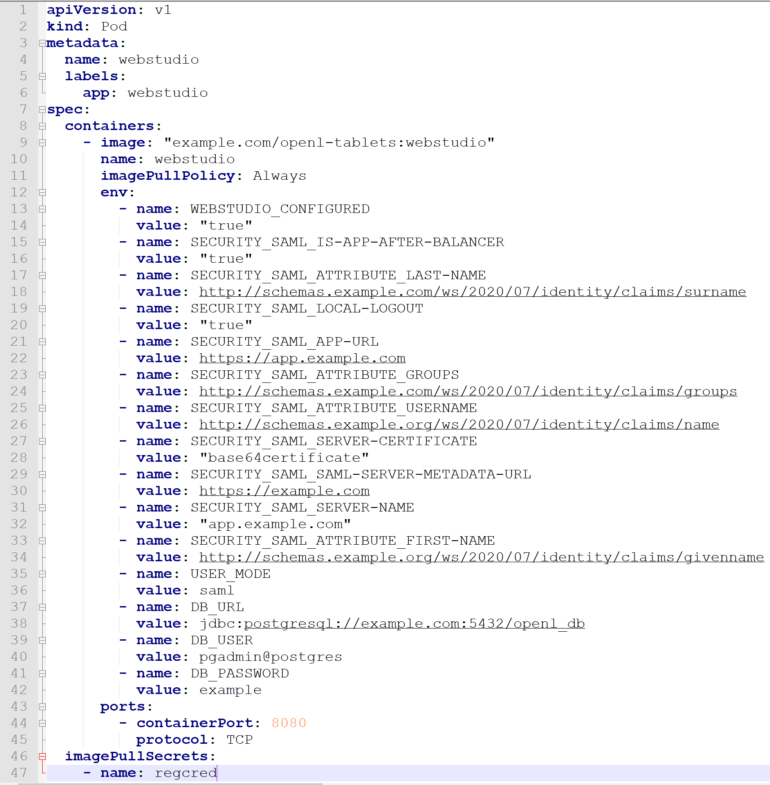

Figure 28: OpenL Tablets WebStudio Kubernetes configuration map example

# Appendix C: CORS Filter Support Enablement in OpenL Tablets WebStudio

**Cross-Origin Resource Sharing (CORS)** is a specification which is a standard mechanism that enables cross-origin requests. For more information on how to enable CORS filter support in OpenL Tablets WebStudio, see **[**[**OpenL Tablets Rule Services Usage and Customization Guide**](http://openl-tablets.org/files/openl-tablets/latest/OpenL%20Tablets%20-%20Rule%20Services%20Usage%20and%20Customization%20Guide.pdf)**]**, the CORS Filter Support section.
