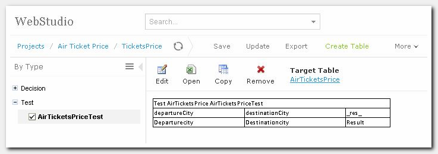

**Getting Started: Write Rules**

Introduction

The purpose of this tutorial is to help you to get started with OpenL Tablets.
This page describes how to start using OpenL Tablets with a simple example.

In the course of this tutorial we will create a simple rule based on existing
requirements in Excel file and show how to check that it works.

**OpenL Tablets** is a business rules management system based on tables
presented in Excel documents. Providing business-oriented approach, OpenL
Tablets treats business documents containing business logic specifications as
executable rules. In a very simplified view, OpenL Tablets extracts rule tables
from Excel documents and executes them. The rules can be accessible from
different applications. OpenL Tablets tools check all data, syntax and type
errors in order to avoid any user mistakes.

**OpenL Tablets WebStudio** is a web interface application employed by business
users and rules experts to view, edit, and manage business rules and rule
projects created using OpenL Tablets technology.

OpenL Tablets WebStudio and Excel are used for comfortable work of business
analysts and subject matter experts with OpenL Tablets rules allowing them to
represent, test, and maintain business logic.

Before we dive in, here are **OpenL Tablets** basic concepts:

| **Concept** | **Description**                                                                                                                                                                                                                                                                                                                                                                                 |
|-------------|-------------------------------------------------------------------------------------------------------------------------------------------------------------------------------------------------------------------------------------------------------------------------------------------------------------------------------------------------------------------------------------------------|
| Rules       | In OpenL Tablets, a basic rule is a logical statement consisting of conditions, actions and returned values. If a rule is evaluated and all its conditions are true then the corresponding actions are executed or/and result value is returned to the calling program. Basically, a rule is an IF-THEN statement. There are calculator and workflow (algorithm) rules representations as well. |
| Tables      | Basic information OpenL Tablets deals with, such as rules and data, is presented in tables. OpenL Tablets offers different types of tables for different types of processing. OpenL includes such rule table types as decision tables, lookup tables, decision trees, spreadsheet-like calculators.                                                                                             |
| Projects    | An OpenL Tablets project is a container of all resources required for processing rule related information. Usually, a simple project contains just Excel files with rules.                                                                                                                                                                                                                      |

More details can be found in [OpenL Tablets Reference
Guide](https://openl-tablets.org/files/openl-tablets/latest/OpenL%20Tablets%20-%20Reference%20Guide.pdf),
*Chapter 1: Introducing OpenL Tablets*.

Quick Start

To start working with OpenL WebStudio you can use our online demo. Please note
that it is for demonstration purposes only and all the content is deleted from
it once a day.

Use the following links to the applications of our Live Demo:

| **Demo application**         | **Url**                                                |
|------------------------------|--------------------------------------------------------|
| WebStudio                    | <http://demo.openl-tablets.org/webstudio>              |
| Rule Services                | <http://demo.openl-tablets.org/webservice>             |
| Rule Services client example | <http://demo.openl-tablets.org/webservice-client.html> |

You can always download and install OpenL Tablets **Demo package** from
[Downloads](https://openl-tablets.org/downloads) page, **Demo** (zip) link. To
start OpenL Tablets Demo, locate \<unzipped Demo package
folder\>\\apache-tomcat-x.x.x\\start.cmd file and run it by double-click (or via
console window commands). Open the browser and use the following link to Welcome
Page of your local OpenL Tablets Demo:

| **Demo Package Url** | <http://localhost:8080/> |
|----------------------|--------------------------|

**Note**: There are some specifics of launching OpenL Tablets Demo under Linux
or Mac. A working directory for OpenL Tablets Demo is located \<unzipped Demo
package folder\>\\apache-tomcat-x.x.x\\openl-demo\\. That is why after unzipping
OpenL Tablets Demo zip file a user should change access rights to this folder by
entering the following command in command line:sudo chmod 775 -R /\<unzipped
Demo package folder\>

For more details on OpenL Tablets Demo you can refer to [OpenL Tablets Demo
Package
Guide](https://openl-tablets.org/files/openl-tablets/latest/OpenL%20Tablets%20-%20Demo%20Package%20Guide.pdf).

When you open WebStudio you will see WebStudio start page at your browser:

*Figure 1: OpenL Tablets WebStudio Home page*

Rule Creation

**OpenL Tablets** utilizes Excel concepts of workbooks and worksheets containing
rules. Rule **project** where rules are maintained consists of Excel files that
are called **modules**. Each workbook is comprised of one or more worksheets
used to separate information by logical **categories** (so you’ll understand
your rules better). Each worksheet, in turn, is comprised of one or more OpenL
tables that represent **rules**. Workbooks can include rule tables of different
types and different underlying logic.

Rules can be created with following tools:

1.  OpenL WebStudio Table Wizards.
2.  Microsoft Excel. In this case the rule file should be uploaded in WebStudio
    where it will be validated and properly tested.

In this tutorial we are going to see creation of a rule and its test in
Microsoft Excel and then their updating and testing in WebStudio. Yet you can
create the same rule directly in WebStudio using Simple Rules Table Wizard on
your own.

Details about creating rules and different rule table types can be found in
[OpenL Tablets Reference
Guide](https://openl-tablets.org/files/openl-tablets/latest/OpenL%20Tablets%20-%20Reference%20Guide.pdf),
*Chapter 2: Creating Tables for OpenL Tablets.*

Here we are going to create a business rule according to Excel file that
contains requirements. The idea is that by slightly modifying original
requirements we can create ready-to-execute OpenL rules without any special
efforts and few special knowledge.

**‘Air Ticket Price’ Rule Creation in Excel**

The following example demonstrates how to create a simple rule that determines
the air ticket price value depending on a city of departure and a city of
destination. For example, if departure city is Chicago and destination city is
Madrid, we want our rules to return \$900 as an air ticket price.

The business requirements are represented as following Excel table at
[**TicketsPrice.xls**](https://openl-tablets.org/uploads/images/GettingStartedWriteRules/TicketsPrice.xlsx)
file:

*Figure 2: A spreadsheet requirements for Air Tickets Price rule*

To enable this table as executable rule table all you need to do is just to add
several OpenL Tablets instructions:

This table matches Simple Decision Table structure. To instruct OpenL how to
treat your rules and to specify that the table is a Simple Decision Table, add a
new row just above our requirements table, merge cells in it across the table
width and enter corresponding OpenL Tablets instruction with the following
content:

SimpleRules Double AirTicketsPrice (String departureCity, String
destinationCity)

*Figure 3: Adding a table header with OpenL Tablets instructions*

Here:

SimpleRules is the keyword identifying a decision table. It instructs OpenL how
to process your table.

Double, String are type names specifying value types returned by the rule and
input value types respectively. Double stands for a number with float point,
String stands for any text input.

AirTicketsPrice is the name of the rule used to reference this table from other
rules or your rules-consumer-application.

departureCity and destinationCity are names of input parameters for the rule.
You can use these names anywhere in your rule. Depending on the input values,
that the user enters, OpenL Tablets selects the result value.

Details on data types can be found in [OpenL Tablets Reference
Guide](https://openl-tablets.org/files/openl-tablets/latest/OpenL%20Tablets%20-%20Reference%20Guide.pdf),
*Chapter 3: OpenL Tablets Functions and Supported Data Types*.

Rule Project Creation

Now after we have the rule created and ready to use let’s create a project with
just created rules in WebStudio. We’ll create a project from Excel file
**TicketsPrice.xls** containing our AirTicketsPrice rule that we prepared in
previous step.

To do it:

1.  Switch to the Repository Editorby clicking the **Repository** link.

    

    *Figure 4: Repository Editor*

    **Repository** provides the following main features:

    -   organizing collaboration work within the company
        -   modifying project structure and properties
        -   managing project deployments and project revisions
    1.  Click **Create Project** button**. Create Project from** window will
        appear. Select **Excel Files** tab.

*Figure 5: Create Project from.. window*

1.  **Add** and **Upload** **TicketsPrice.xls** file.

*Figure 6: Upload Excel file*

1.  In the **Project Name** field, enter ’Air Ticket Price’ and click
    **Create.**

*Figure 7: Creating project from Excel file*

1.  Your new Project **Air Ticket Price** appears in the Projects tree in
    ‘Editing’ status. It means that you can change your project and rules in it
    in Rules Editor.

*Figure 8: Created Air Ticket Price project*

It’s worth to mention that WebStudio allows creating projects with Tutorials and
Examples quickly from **Create Project** dialog.

Editing Rule

1.  Switch to the **Rules Editor** using top level menu and select the created
    Decision rule from the tree on the left.

*Figure 9: Air Tickets Price Decision table in Rules Editor*

**Rules Editor** allows you to browse rule modules (in other words – Excel files
in the project), create and modify rules and other rule tables, ad-hoc test
rules and create test tables for them. OpenL Tablets verifies syntax and type
errors in all tables. Moreover, Rules Editor provides calculation explanation
capabilities, enabling expansion of any calculation result and viewing the
source rule table for that result so that the user gets full information on how
the rule result was calculated.

1.  Now you can edit AirTicketsPrice rule directly in WebStudio.
    1.  Click **Edit** button to
        edit Decision Table and update ticket price for Atlanta/London.

*Figure 10: Air Tickets Price Decision table update*

1.  Save updated Decision Table.

Alternatively, you can click **Open** button - the rule file is opened in Excel
– and apply all required changes in Excel. Your changes become available in
WebStudio right upon Excel file saving.  
**Note**: This is valid only when WebStudio runs on your machine, if not – use
**Export** and **Update** buttons to download the file on your machine, edit in
Excel and then import the updated file into the project).

Testing Rule

So, what we see is that WebStudio doesn’t highlight the rule we created with red
and problem pane at the bottom of the page is empty. It means we’ve created the
rule correctly.

Now let’s ensure that the rule logic is the proper one.

WebStudio has ad hoc testing of rules feature. For that you should click **Run**
button on the menu, input values for test and click **Run** button in the popup.

*Figure 11: Running ad hoc test*

The following result will appear:

*Figure 12: Results of test run*

The second way to test the rule is to create a test table where you define test
cases - their input and expected result values. Test table calls the rule for
each test case and checks whether the actual returned value matches the expected
value or not. Test tables can be created and modified in WebStudio or Excel,
it’s up to you which option to choose.

Let’s create a test table for our rule in WebStudio.

**‘Air Ticket Price’ Test Creation in WebStudio**

To create a table for testing the AirTicketsPrice rule, proceed as follows:

1.  Click button **Create Test** to create a new Test while you view the rule
    table.

*Figure 13: Create Test*

1.  Test Name is prefilled automatically by the decision table name and word
    ‘Test’ is added in the end. Click **Next.**

*Figure 14: Create test window*

1.  Click **Save** accepting default values of destination where the test table
    will be placed in**.**

*Figure 15: Select destinationwindow*

1.  Test Table is created. Now you can edit the table by updating column titles
    (if needed) and adding test data (as with rule tables, it can be done in
    WebStudio or in Excel file).

*Figure 16: Initial Test Table*

**Editing Test in Excel**

1.  To edit the test in Excel click
     and update the table in
    opened Excel file.

*Figure 17: Test Table being updated in Excel file*

1.  Save changes made in Excel. Your changes become available in WebStudio right
    upon Excel file saving (as we mentioned before, if WebStudio doesn’t run on
    your machine then you need to update the file in WebStudio - click
    **Update** button and upload updated version of the file).
    1.  Test Table is refreshed and updated data is displayed in WebStudio.

*Figure 18: Updated Test Table in WebStudio*

**Editing Test in WebStudio**

1.  Click **Edit**  button to
    edit the test table one more time but in WebStudio.
2.  Add test data:
    1.  Click on any table cell. Table editor menu becomes enabled.
        1.  In Table editor menu select button
             to insert row before
            the selected one. Insert two rows.

            

            *Figure 19: Table editor menu*

        2.  Add test data and **Save** your changes.

            

            *Figure 20: Add test data*

**Test Execution**

1.  Run the test table. To execute all test cases, click the **Run** button.

*Figure 21: Run Test*

1.  WebStudio will display test results.

*Figure 22: Test resultswindow*

Failed test cases are marked by the
 .

Passed test cases are marked by the
 .

All test cases are passed. Hence, our rule AirTicketsPrice works correctly.

Conclusion

Congratulations, your first rule is created, tested and ready to be used by the
consumer-application!

You have created the Rule, which defines the air tickets price value depending
on a city of departure and a city of destination. You have also created the Test
for your Rule to check correctness of rule logic.

We hope that work with OpenL Tablets was interesting and easy for you.

Now, you can try to create more advanced Rules. To create more advanced rules
please follow descriptions in
[Tutorials](https://openl-tablets.org/documentation/tutorials)**.**

